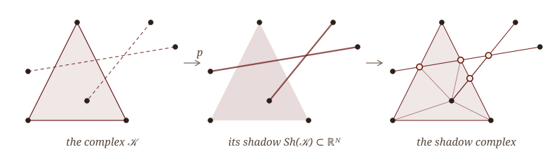
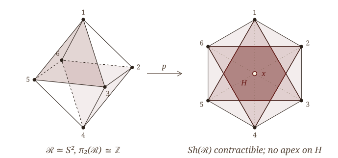
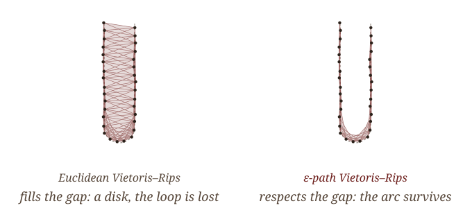
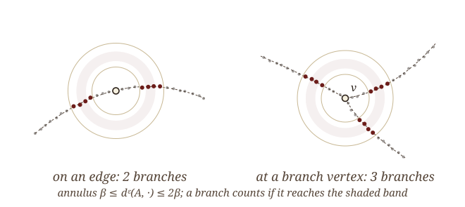
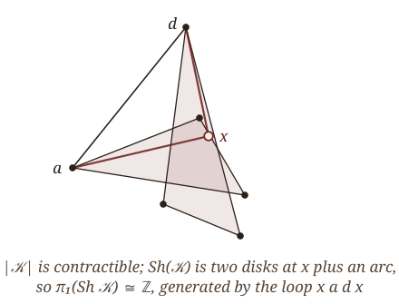
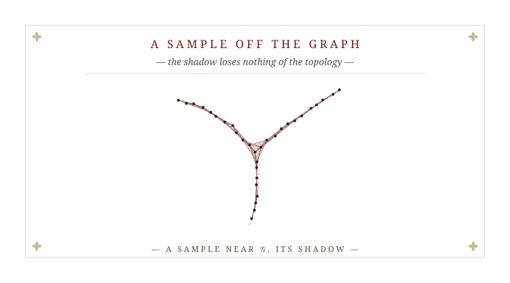

# § I.  The Shadow and Its Obstruction {.section-divider}

::: {.plate data-plate="I"}

:::

::: {.notes}
Section one: what the shadow is, and the theorem that says it usually fails.
:::


## Where is the shape?

::: {.standfirst .math}
A sample $\mathcal S\subset\mathbb R^N$ lies near an unknown graph $\mathcal G\subset\mathbb R^N$. Vietoris–Rips complexes recover *what* $\mathcal G$ is. They do not say *where* it is.
:::

::: {.definition data-num="1" data-name="Vietoris–Rips complex"}
For a metric space $(\mathcal S,d)$ and a scale $\beta>0$, $\mathcal R_\beta(\mathcal S)$ is the abstract simplicial complex with a simplex for every finite $\sigma\subseteq\mathcal S$ of diameter $<\beta$. It is a flag complex: determined by its edges.
:::

::: {.rmk data-name="What is known"}
Rips complexes recover homotopy type at suitable scales. Metric-graph reconstructions (Aanjaneya–Chazal–Chen–Glisse–Guibas–Morozov; Lecci–Rinaldo–Wasserman; Bokor–Turner–Williams) recover a graph up to homeomorphism, but return a combinatorial or abstract graph. For branched graphs in $\mathbb R^N$ we know of no embedded output proved both homeomorphic and Hausdorff-close.
:::

::: {.problem .fragment data-num="2" data-name="Geometric reconstruction"}
From a finite $\mathcal S\subset\mathbb R^N$ with $d_H(\mathcal S,\mathcal G)$ small, compute from $\mathcal S$ alone

1. an embedded $1$-complex $C\subset\mathbb R^N$ with $C\cong\mathcal G$ and $d_H(C,\mathcal G)$ small, and
2. a polyhedron in $\mathbb R^N$ whose topology is that of $\mathcal G$,

at scales stated in explicit quantities of $\mathcal G$.
:::

::: {.notes}
The setting. There is an unknown embedded metric graph G in R^N (road networks from GPS traces, vascular and neuronal trees, fault networks from earthquake hypocenters) and a finite sample S that is merely Hausdorff-close to it.

The Vietoris–Rips complex is the standard tool. It is a flag complex, so it costs no more than its edges, and it does not care about the ambient dimension. Its homotopy theory is well developed. And there is a separate literature on metric graph reconstruction, starting with Aanjaneya, Chazal, Chen, Glisse, Guibas and Morozov, that recovers the graph up to homeomorphism. But every one of these returns an abstract or combinatorial object. Where the reconstruction sits in R^N is not part of the guarantee.

So the problem for this talk has two halves: an embedded 1-complex, homeomorphic and Hausdorff-close; and a polyhedron in the same R^N with the right topology. Every scale stated explicitly.
:::


## The shadow

::: {.definition data-num="3" data-name="Shadow"}
Let $\mathcal K$ be a simplicial complex with vertices $\mathcal K^{(0)}\subset\mathbb R^N$. The *shadow projection* $p\colon|\mathcal K|\to\mathbb R^N$ sends each vertex to itself and extends linearly over simplices. The *shadow* is
$$
\mathrm{Sh}(\mathcal K)\;=\;p\big(|\mathcal K|\big)\;=\;\bigcup_{\sigma\in\mathcal K}\operatorname{Conv}(\sigma)\;\subset\;\mathbb R^N .
$$
For the Euclidean complex this is also written $SR(F;\beta)=\mathrm{Sh}(\mathcal R_\beta(F))$.
:::

::: {.fig-wide style="width: 60%; margin: 0 auto;"}

:::

::: {.definition .fragment data-num="4" data-name="Shadow complex"}
A triangulation $\mathrm{SC}(\mathcal K)$ of $\mathrm{Sh}(\mathcal K)$ in which every $\operatorname{Conv}(\sigma)$ is a subcomplex. *Carrier property:* if the relative interior of $|\tau|$ meets $\operatorname{Conv}(\sigma)$, then $|\tau|\subset\operatorname{Conv}(\sigma)$.
:::

::: {.notes}
Kazuhiro has just defined this, as SR of F and beta; I will write Sh of the complex, because we will take shadows of complexes other than the Euclidean Rips complex. The shadow is the natural candidate for the second half. Take a complex whose vertices happen to be points of R^N. The shadow projection sends each vertex to itself and extends linearly; its image, the union of the convex hulls of the simplices, is the shadow, an explicit polyhedron in R^N.

In the picture: an abstract complex with a triangle and two edges crossing it; its shadow; and a shadow complex, a triangulation of the shadow in which every hull is a subcomplex. Such a triangulation always exists, by common subdivision of finitely many polyhedra. The one fact the arguments use is the carrier property: a shadow simplex that enters a hull lies inside it.

The map p is continuous and onto its image. The question is whether it is a homotopy equivalence.
:::


## The Euclidean obstruction

::: {.theorem data-num="5" data-cite="Chambers–de Silva–Erickson–Ghrist 2010"}
Let $\mathcal S\subset\mathbb R^N$ be finite and $\mathcal R_\beta(\mathcal S)$ its **Euclidean** Vietoris–Rips complex.

1. If $N=2$, then $p$ is bijective on $\pi_0$ and an isomorphism on $\pi_1$.
2. If $N=2$ and $k\ge2$, then $p_*$ on $\pi_k$ need not be injective.
3. If $N\ge4$, then $p_*$ on $\pi_1$ need not be surjective.
:::

::: {.fig-wide .fragment style="width: 50%; margin-top: 0;"}

:::

::: {.aside-note .fragment}
In $\mathbb R^3$, $p_*$ is onto on $\pi_1$ (Adamaszek–Frick–Vakili 2017). The theory stops at the plane.
:::

::: {.notes}
(If this follows Kazuhiro's talk, he has just stated these; do not dwell.) in the plane the projection is 1-connected; already in the plane higher homotopy is not preserved; from dimension four on even the fundamental group fails; and in R^3 surjectivity on pi_1 is due to Adamaszek, Frick and Vakili.

What I want is the picture, their planar example. Six points on a regular hexagon, at a scale between the short and long diagonals: every pair is an edge except the three antipodal pairs, so the flag complex is an octahedron, a 2-sphere. Its shadow is the solid hexagon, contractible. The shaded central hexagon comes back in section four.
:::


## The shadow in the limit

::: {.theorem data-num="6" data-name="In the limit" data-cite="Kawamura–Majhi–Mitra"}
Let $M\subset\mathbb R^N$ be a compact ANR whose metric satisfies (M1)–(M3), and let $F$ range over the finite subsets of $M$. Then
$$
\varprojlim_{\beta}\ \varinjlim_{F}\ \pi_q\big(\mathrm{Sh}(\mathcal R_\beta(F))\big)\;\cong\;\pi_q(M),
$$
and, given a Hausmann-type theorem for $M$, the shadow projections induce an isomorphism of the same limits from $\pi_q(\mathcal R_\beta(F))$.
:::

::: {.env-row}
::: {.rmk .fragment data-name="Question (a): stabilization" data-cite="Kawamura"}
When is $\varprojlim_\beta\varinjlim_F\pi_q\big(\mathrm{Sh}(\mathcal R_\beta(F))\big)\cong\pi_q\big(\mathrm{Sh}(\mathcal R_\beta(F))\big)$ for **one** dense finite $F$ and **one** small $\beta$?
:::

::: {.rmk .fragment data-name="This talk"}
For embedded graphs, with the Euclidean metric on the sample replaced by a path metric $d^\varepsilon_{\mathcal S}$: explicit scales, one finite sample. A homeomorphic $1$-complex at one scale; for the shadow, a two-scale form of (a).
:::
:::

::: {.aside-note .fragment}
The obstruction is a theorem about the **Euclidean** metric. We decline its hypothesis; we do not contradict it.
:::

::: {.notes}
This is where Kazuhiro's talk ended; in another venue, introduce it as the limit theorem of Kawamura, Majhi and Mitra. In the limit, the system of shadows recovers the homotopy groups of any compact ANR with a reasonable metric, and the shadow projections are isomorphisms in the limit. It is a geometric Latschev theorem, and it is qualitative.

His first closing question was stabilization: when does one dense finite sample, at one small scale, already carry the limit?

This talk is an answer to a version of that question. Two changes of setting: the shape is an embedded graph, and the metric on the sample is not Euclidean but a path metric built from its pairwise distances. In that setting everything is at explicit scales and for one finite sample: a homeomorphic 1-complex at a single scale, and for the shadow a two-scale form of stabilization, where every feature that survives an explicit enlargement is a feature of the graph.

And the reason changing the metric is allowed: the obstruction we just saw is a theorem about the Euclidean metric. Chambers et al. remain true; their hypothesis is simply not met.

This is joint work with Kazuhiro and Atish.
:::


# § II.  Change the Metric {.section-divider}

::: {.plate data-plate="II"}

:::

::: {.notes}
Section two: the path metric, what it already buys for the abstract complex, and the two quantities of the graph that everything else is stated in.
:::


## The $\varepsilon$-path metric

::: {.env-row}
::: {.definition data-num="7" data-name="Path metric"}
For $\mathcal A\subset\mathbb R^N$ and $\varepsilon>0$, an *$\varepsilon$-path* from $p$ to $q$ is a chain $p=a_0,a_1,\dots,a_{k+1}=q$ in $\mathcal A$ with $\|a_i-a_{i+1}\|<\varepsilon$. Set
$$
d^\varepsilon_{\mathcal A}(p,q)=\inf\ \sum_i\|a_i-a_{i+1}\| ,
$$
and write $\mathcal R^\varepsilon_\beta(\mathcal S)$ for the Vietoris–Rips complex of $(\mathcal S,d^\varepsilon_{\mathcal S})$.
:::

::: {.proposition .fragment data-num="8" data-name="Comparison" data-cite="Majhi 2023"}
If $d_H(\mathcal S,\mathcal G)<\tfrac12\xi\varepsilon$ with $\xi\in(0,1)$, and $\|a-A\|,\|b-B\|<\tfrac12\xi\varepsilon$ for $a,b\in\mathcal G$, $A,B\in\mathcal S$, then
$$
\|A-B\|\;\le\;d^\varepsilon_{\mathcal S}(A,B)\;\le\;\frac{d_{\mathcal G}(a,b)+\xi\varepsilon}{1-\xi}.
$$
:::
:::

::: {.fig-wide .fragment style="width: 52%;"}

:::

::: {.notes}
The replacement metric. An epsilon-path hops through the sample in steps shorter than epsilon; the epsilon-path distance is the shortest such chain. It is computed from pairwise Euclidean distances alone: build the epsilon-neighborhood graph and run shortest paths. No knowledge of G is needed.

The comparison says what it measures: up to 1/(1-xi) and an additive xi epsilon, it is the intrinsic distance along the graph, and it never undercuts the Euclidean distance.

The picture: a hairpin, two legs of one arc, close in R^N and far along the arc. The Euclidean Rips complex at this scale bridges the gap and fills in a disk. The path-metric complex on the same points, at the same beta, does not. Both complexes are computed from the sample, not drawn.
:::


## What we import: the abstract complex

::: {.theorem data-num="9" data-name="Homotopy reconstruction" data-cite="Komendarczyk–Majhi–Mitra, JACT"}
[Let $\mathcal G\subset\mathbb R^N$ be a compact, connected metric graph. Fix $\xi\in(0,\tfrac14)$, let $0<\beta<\tfrac14\ell(\mathcal G)$, and choose $0<\varepsilon\le\tfrac13\beta$ with $\delta^\varepsilon_\beta(\mathcal G)\le\tfrac{1+2\xi}{1+\xi}$.]{.hyp} If $d_H(\mathcal G,\mathcal S)<\tfrac12\xi\varepsilon$, then
$$
\mathcal R^\varepsilon_\beta(\mathcal S)\;\simeq\;\mathcal G .
$$
:::

::: {.env-row}
::: {.rmk data-name="The constants"}
$\ell(\mathcal G)$ is the girth. $\delta^\varepsilon_\beta(\mathcal G)$ is a large-scale distortion of $\mathcal G$ against its $\varepsilon$-thickening; it tends to $1$ as $\varepsilon\to0$, so the condition is a density requirement.
:::

::: {.rmk .fragment data-name="The boundary"}
In the plane the same paper also proves $\mathrm{Sh}(\mathcal R^\varepsilon_\beta(\mathcal S))\simeq\mathcal G$ at one scale, through the Jordan curve theorem and the asphericity of planar sets. What follows is the geometry in **every** $N$.
:::
:::

::: {.notes}
What we import. For the abstract path-metric Rips complex the homotopy type is known in any ambient dimension: Komendarczyk, Majhi and Mitra, in JACT. The hypotheses are the girth and a large-scale distortion that tends to one as epsilon shrinks, so a small enough epsilon always exists. There is no condition at all on the angles at vertices.

That paper also proves the shadow theorem, but only in the plane, and its argument is planar at its core: the Jordan curve theorem, and the fact that planar sets are aspherical. The homotopy half went to R^N; the geometric half stayed in R^2. What we add is the geometry in every dimension.
:::


## Two quantities of the graph

::: {.definition data-num="10" data-name="Hypotheses and the condition number"}
(A1) $\mathcal G$ is compact, connected, with finitely many edges; (A2) two edges share at most one vertex; (A3) edges are $C^1$ with one-sided tangents at their ends; (A4) incident edges meet at positive angles. With $\theta_{\min}$ the sharpest angle,
$$
\Theta(\mathcal G)=\max\big\{\tfrac12,\ \cos^2(\tfrac12\theta_{\min})\big\}\in\big[\tfrac12,1\big),\qquad \sqrt{1-\Theta}=\min\big\{\sin\tfrac{\theta_{\min}}{2},\tfrac{1}{\sqrt2}\big\}.
$$
:::

::: {.definition .fragment data-num="11" data-name="Shadow radius"}
$\Delta(\mathcal G)$ is the supremum of the $r>0$ such that
$$
d_{\mathcal G}(x,y)\;\le\;\frac65\cdot\frac{\|x-y\|}{\sqrt{1-\Theta(\mathcal G)}}\qquad\text{whenever } x,y\in\mathcal G,\ \|x-y\|\le r .
$$
:::

::: {.env-row}
::: {.proposition .fragment data-num="12" data-name="Positivity"}
Under (A1)–(A4), $\Delta(\mathcal G)>0$, with an explicit lower bound. For straight edges, $\Delta(\mathcal G)\ge\tfrac12\min\{\|x-y\|: d_{\mathcal G}(x,y)\ge\tfrac12\lambda(\mathcal G)\}$, a finite computation.
:::

::: {.rmk .fragment data-name="Why this constant"}
Two straight edges at angle $\theta$: points at distance $t$ from the vertex have $d_{\mathcal G}=2t$ and $\|x-y\|=2t\sin\tfrac{\theta}{2}$. The definition allows $\tfrac65$ of that ratio. $\Delta=\infty$ for a segment or a straight star; it is finite only where parts of $\mathcal G$ far apart along $\mathcal G$ come close in $\mathbb R^N$.
:::
:::

::: {.notes}
Everything from here is stated in two quantities of G.

The hypotheses are mild: finitely many C^1 edges, and positive angles at vertices. The condition number Theta records the sharpest angle; the square root of 1 minus Theta is essentially the sine of half of it. A three-pronged star at 120 degrees has Theta one half; squeeze the sharpest angle to under 30 degrees and Theta is 0.94.

The shadow radius is new, and it is one line: the scale below which the graph distance is at most six fifths of the Euclidean distance divided by that sine. For two straight edges meeting at angle theta the ratio is exactly one over sine theta over two, so the definition allows six fifths of the corner's own ratio, within twenty percent of exact. It replaces the chord condition of the planar paper, which implies it at a smaller scale; the converse fails, and only a single-scale lifting argument needs chords. What it rules out, below the radius, is two parts of the graph passing close to each other without meeting: the hairpin. Below Delta, Euclidean proximity in G is explained by its sharpest corner.

It is positive under A1 to A4, with an explicit bound, and for polygonal graphs it is a finite computation over pairs of edges. One honest remark: A4 does give G positive mu-reach, so we claim no larger class of graphs. The advance is in the output, and in the certification.
:::


# § III.  Embedded Reconstruction {.section-divider}

::: {.plate data-plate="III"}

:::

::: {.notes}
Section three, the first main result. For graphs, homotopy type is weak: it sees only the first Betti number, so a theta graph and a wedge of two circles are indistinguishable. We want the graph up to homeomorphism, embedded.
:::


## Reading the degree off the sample

::: {.definition data-num="13" data-name="Degree, clusters, arcs"}
For $A\in\mathcal S$ take the annulus $\mathcal A(A)=\{\beta\le d^\varepsilon_{\mathcal S}(A,\cdot)\le2\beta\}$ and its band $\mathcal W(A)=\{\tfrac54\beta\le d^\varepsilon_{\mathcal S}(A,\cdot)\le\tfrac{33}{20}\beta\}$; $\deg_\beta(A)$ counts the components of the $\varepsilon$-graph on $\mathcal A(A)$ that meet $\mathcal W(A)$. Points with $\deg_\beta\ne2$ are grouped into *clusters* (links of $d^\varepsilon$-length $\le5\beta$); deleting their $\beta$-neighborhood leaves the *arcs*. $C(\mathcal S,\beta,\varepsilon)$ has a vertex per cluster and an edge per arc, drawn as $\varepsilon$-graph paths through a *witness* deep in the arc, the two halves leaving it through its two different sides.
:::

::: {.fig-row}
::: {.fig style="flex-basis: 56%;"}

:::

::: {.stmts}
::: {.rmk .fragment data-name="Whose device"}
The degree statistic is that of Aanjaneya et al. (2012), for abstract metric graphs. New here: the Hausdorff noise model, a noise-robust count (the band), and an embedded output $C\subset\mathrm{Sh}(\mathcal R^\varepsilon_\beta(\mathcal S))$.
:::
:::
:::

::: {.notes}
The construction is not ours, and I want to say so clearly: counting components of a punctured neighborhood to find branch points is the device of Aanjaneya, Chazal, Chen, Glisse, Guibas and Morozov, whose statistics Lecci, Rinaldo and Wasserman analyzed.

For each sample point, look at the annulus between beta and 2 beta in the path metric and count the components of its epsilon-graph, but only those that reach the inner band; that discards stray points near the two boundaries, whose membership the noise cannot decide. On an edge the count is two; near a branch vertex it is the degree. The flagged points cluster into branch vertices; removing their neighborhoods leaves the arcs, which become edges. Each edge is drawn through a witness point deep inside its arc, and its two halves leave the witness through the witness's two different sides. That rule is what makes the edge over a loop actually go around the loop, rather than out and back along one half.

What is different is the input and the output. Their input is a metric approximation of the graph; ours is a Euclidean sample that is merely Hausdorff-close. Their output is abstract; ours is drawn from edges of the Rips complex, so it sits in R^N, inside the shadow.
:::


## Embedded homeomorphic reconstruction

::: {.theorem data-num="14" data-name="Embedded homeomorphic reconstruction" data-cite="Kawamura–Majhi–Mitra"}
[Let $\mathcal G\subset\mathbb R^N$ satisfy (A1)–(A4), with a vertex of degree $\ne2$. Fix $\xi\in(0,\tfrac1{12}]$; let $3\beta\le\Delta(\mathcal G)$, $5\beta\le\ell(\mathcal G)$, $15\beta\le\lambda(\mathcal G)$; and let $\varepsilon\le\tfrac1{48}\beta$ with $\delta^\varepsilon_\beta(\mathcal G)\le\tfrac{1+2\xi}{1+\xi}$ and]{.hyp}
$$
\frac{5\varepsilon}{2\sqrt{1-\Theta(\mathcal G)}}\;<\;\beta .
$$
If $d_H(\mathcal S,\mathcal G)<\tfrac12\xi\varepsilon$, then $C(\mathcal S,\beta,\varepsilon)\cong\mathcal G$, $C\subset\mathrm{Sh}(\mathcal R^\varepsilon_\beta(\mathcal S))$, and $d_H(C,\mathcal G)<4.5\beta$.
:::

::: {.env-row}
::: {.rmk .fragment data-name="The window closes from below"}
The lower end is the scale at which two branches at angle $\theta_{\min}$ have drifted $\varepsilon$ apart: sharper angles force *larger* $\beta$. It is non-empty once $\varepsilon<\tfrac25\sqrt{1-\Theta}\,\min\{\tfrac13\Delta,\tfrac15\ell,\tfrac1{15}\lambda\}$.
:::

::: {.rmk .fragment data-name="One scale, any dimension"}
Only the $1$-skeleton is used, and the metric only to radius $9\beta$: $O\big(n(k_\rho+n_\rho\log n_\rho)\big)$ time, near-linear for bounded density, independent of $N$. The shadow is never built.
:::
:::

::: {.notes}
The first theorem. Under A1 to A4 alone, and at a single scale in any dimension, the extracted complex is homeomorphic to G, lies inside the shadow, and is within 4.5 beta of G.

The window has four upper ends: a third of the shadow radius, a fifth of the girth, a fifteenth of the shortest edge. The fifteenth keeps the neighborhoods of distinct branch vertices apart; the girth keeps the two sides of a point apart; the shadow radius turns Euclidean proximity of samples into graph proximity of their projections.

The lower end is the interesting one, and it has no counterpart in the metric setting, because it is Euclidean geometry at a vertex. Two branches at the sharpest angle must have drifted more than epsilon apart by the time the annulus sees them. So the window closes from below: sharper angles need larger beta. The next slide shows this form is forced.

Cost: only the one-skeleton, and the metric only locally. Near-linear for bounded local density, nothing depends on N, and the shadow is never built.
:::


## Sharp in form, and isotopic when straight

::: {.proposition data-num="15" data-name="The lower end is forced"}
On a planar $Y$-graph with two segments at angle $\theta\le\tfrac\pi2$ and a dense sample on it, if $4\beta\sin\tfrac\theta2<\varepsilon$ then $\deg_\beta(v)=2$ at the branch vertex $v$: the statistic cannot see it.
:::

::: {.rmk .fragment data-name="So only the constant is loose"}
Any window for this statistic has the form $c\,\varepsilon/\sin\tfrac{\theta_{\min}}2<\beta$, and the theorem's $c=\tfrac52$ is within a factor of ten of the necessary $\tfrac14$.
:::

::: {.theorem .fragment data-num="16" data-name="Isotopy for straight-line graphs" data-cite="Kawamura–Majhi–Mitra"}
[Let $\mathcal G$ be a straight-line graph satisfying the hypotheses of the theorem, with $5\beta\le\Delta(\mathcal G)$ and $\lambda(\mathcal G)>\tfrac{6\beta}{\sqrt{1-\Theta}}$.]{.hyp} Then $C$ with its edges straightened is ambient isotopic to $\mathcal G$ in $\mathbb R^N$, by an isotopy moving points less than $2.3\beta$. For $N=3$ this recovers the knot type of a polygonal graph.
:::

::: {.notes}
Two refinements of the theorem.

First, the lower end of the window is not an artifact. On a Y-shaped graph with a sharp angle theta and a dense sample, once 4 beta sin theta over two is below epsilon, the two sharp branches are still joined in the epsilon-graph across the whole annulus, and the statistic sees two branches at the branch vertex. So any window for this statistic has the form constant times epsilon over sin theta over two; ours has constant five halves, and the necessary one is a quarter.

Second, for straight-line graphs we get the embedding class, not just the homeomorphism type. Straighten the edges of C: the result is ambient isotopic to G in R^N, by an isotopy that moves points less than 2.3 beta. The proof moves each vertex of G to its cluster representative and interpolates. In R^3, that recovers the knot type of a polygonal knotted graph. For curved edges, isotopy remains open.
:::


## Stability, and where this sits

::: {.corollary data-num="17" data-name="Stability of the homeomorphism type"}
[Let $\mathcal G,\mathcal G'\subset\mathbb R^N$ both satisfy the hypotheses of the theorem, with the same $\xi,\beta,\varepsilon$.]{.hyp} If $d_H(\mathcal G,\mathcal G')<\tfrac14\xi\varepsilon$, then $\mathcal G\cong\mathcal G'$.
:::

::: {.sketch .fragment}
One fine sample is close enough to both graphs, and $C(\mathcal S,\beta,\varepsilon)$ depends on $\mathcal S$ and the scales alone. The radius is a fixed multiple of $\xi\sqrt{1-\Theta}\,\min\{\Delta,\ell,\lambda\}$.
:::

::: {.methods .fragment}
| Method | Input | Output | Guarantee |
|:--|:--|:--|:--|
| Aanjaneya et al. 2012 | metric $(\varepsilon,R)$-approximation | abstract metric graph | homeomorphic |
| Lecci–Rinaldo–Wasserman 2014 | sample in a tube | combinatorial graph | isomorphic; needs reach |
| Bokor–Turner–Williams 2021 | sample, straight edges | linear graph | structure; embedding fitted |
| Dey–Wang–Wang 2018 | density on a grid | embedded graph | homotopy equivalent |
| **This talk** | **Hausdorff-close sample, $C^1$ edges** | **embedded $1$-complex** | **homeomorphic, $d_H<4.5\beta$; isotopic if straight** |
:::

::: {.notes}
A consequence. The complex C depends only on the sample and the scales. So if two admissible graphs at the same scales are Hausdorff-closer than a quarter xi epsilon, one fine sample is close enough to both, and C is homeomorphic to each of them. The mechanism is general; what is specific here is the class, C^1 edges with an angle condition, and the radius, which is explicit in Theta, Delta, the girth and the shortest edge.

And where this sits. The table sorts the metric-graph reconstructions by what they assume and what they return. Several prove homeomorphism; none returns an embedded complex with a proved Hausdorff bound, and for straight-line graphs ours is even isotopic. We are not faster: we pay the same local shortest-path cost as Aanjaneya et al. What the path metric buys is the noise model and the C^1 class, not speed.
:::


# § IV.  The Apex Condition {.section-divider}

::: {.plate data-plate="IV"}

:::

::: {.notes}
Section four: back to the shadow. The combinatorial condition that decides whether the shadow projection is a homotopy equivalence, in every dimension.
:::


## The apex condition

::: {.env-row}
::: {.definition data-num="18" data-name="Apex condition"}
For $x\in\mathrm{Sh}(\mathcal K)$ let $\mathrm{st}(x,\mathcal K)=\{\sigma: x\in\operatorname{Conv}(\sigma)\}$. A vertex $v_x$ is an *apex* of $x$ if
$$
v_x\ast\mathrm{st}(x,\mathcal K)\subseteq\mathcal K ,
$$
that is, $\sigma\cup\{v_x\}\in\mathcal K$ for every $\sigma\in\mathrm{st}(x,\mathcal K)$. A flag $\mathcal K$ satisfies the *apex condition* if every $x$ has an apex.
:::

::: {.theorem .fragment data-num="19" data-name="Apex theorem" data-cite="Kawamura–Majhi–Mitra"}
If a flag complex $\mathcal K$ with $\mathcal K^{(0)}\subset\mathbb R^N$ satisfies the apex condition, then $p\colon|\mathcal K|\to\mathrm{Sh}(\mathcal K)$ is a homotopy equivalence, in every $N$.
:::
:::

::: {.fig-row}
::: {.fig style="flex-basis: 36%;"}

:::

::: {.stmts}
::: {.sketch .fragment}
Send the barycenter $b_\tau$ of each shadow simplex to an apex $a_\tau$ of it. Along a chain $\tau_0\prec\cdots\prec\tau_m$ the apices are pairwise adjacent: the simplex $\sigma_{\tau_j}\cup\{a_{\tau_j}\}$ covers $b_{\tau_i}$, so $a_{\tau_i}$ sees $a_{\tau_j}$. By flagness they span a simplex: a simplicial map $A\colon\operatorname{sd}\mathrm{SC}(\mathcal K)\to\mathcal K$. Both composites with $p$ stay in single simplices or single convex hulls, so straight lines give the homotopies.
:::

::: {.rmk .fragment}
Nothing refers to $N$. The condition is checkable from the $1$-skeleton and the coordinates: $x\in\operatorname{Conv}(\sigma)$ is a linear feasibility question.
:::
:::
:::

::: {.notes}
The apex condition. At a point x of the shadow, collect every simplex whose hull contains x. The condition asks for one vertex, the apex, that cones off all of them at once. This cone form is weaker than asking that all their vertices together span a simplex, and it is all the proof needs.

The theorem: for a flag complex, the apex condition makes the shadow projection a homotopy equivalence, in every dimension, with no asphericity and no sample in sight.

The proof is short. Triangulate the shadow compatibly with the hulls, subdivide once, and send each barycenter to an apex of it. Along a chain of faces the apices are pairwise adjacent, because the simplex coning off a bigger face also covers the smaller barycenter; and a flag complex turns pairwise adjacency into a simplex. So the map is simplicial. Then both composites move each point only inside one simplex of K, or inside one convex hull in the shadow, and straight-line homotopies finish it.

This was work in preparation last spring. It is now a theorem of the paper.
:::


## The hexagon, revisited

::: {.fig-row}
::: {.fig style="flex-basis: 46%;"}

:::

::: {.stmts}
::: {.example data-num="20" data-name="The hexagon"}
For the octahedral Rips complex of the hexagon, $|\mathcal K|\simeq S^2$ and $\mathrm{Sh}(\mathcal K)$ is contractible. On the central hexagon $H=\operatorname{Conv}[135]\cap\operatorname{Conv}[246]$ an apex would be adjacent to all other five vertices, and every vertex misses its antipode: the condition fails on all of $H$. Off $H$, the vertex beyond whose neighbors' chord $x$ lies is an apex. It fails exactly on $H$.
:::

::: {.rmk .fragment}
Here $p$ is still a $\pi_1$-isomorphism: the apex condition is strictly stronger than $\pi_1$-faithfulness, as it must be. The $\mathbb R^4$ example of Chambers et al. fails it at the identified point in the same way.
:::
:::
:::

::: {.rmk .fragment data-name="Necessity"}
Whether the apex condition is *necessary* for a homotopy equivalence is open.
:::

::: {.notes}
The example that kills the Euclidean theory is exactly a failure of the condition. On the central hexagon, where the two big triangles overlap, both of them cover x, so an apex would have to see all the other five vertices, and every vertex misses its antipode. Off the central hexagon a point lies beyond the chord joining the two neighbors of some vertex, and that vertex is an apex. So the condition fails exactly on the shaded hexagon.

The projection there is still an isomorphism on pi_1, as every planar Euclidean Rips projection is. So the apex condition is strictly stronger than pi_1-faithfulness, as it must be, since it controls all homotopy groups. The four-dimensional example of Chambers et al., two polar triangles with identified centroids, fails it at the identified point in the same way.

Whether it is necessary for a homotopy equivalence, we do not know.
:::


## What $\pi_1$ alone needs

::: {.fig-row}
::: {.stmts}
::: {.definition data-num="21" data-name="Pairwise lifting"}
$\mathcal K$ satisfies *pairwise lifting* if for **all** $\sigma,\tau\in\mathcal K$ with $\operatorname{Conv}(\sigma)\cap\operatorname{Conv}(\tau)\ne\emptyset$:

\(A) some vertex $E$ has $\sigma\cup\{E\},\,\tau\cup\{E\}\in\mathcal K$; or

\(B) up to swapping, some $E,F$ and $A\in\sigma$ have $\tau\cup\{E,F\}\in\mathcal K$, $\{A,E,F\}\in\mathcal K$, and $[EF]\cap\operatorname{Conv}(\sigma)\ne\emptyset$.
:::

::: {.proposition .fragment data-num="22" data-name="Surjectivity"}
Pairwise lifting implies $p_*\colon\pi_1(|\mathcal K|)\to\pi_1(\mathrm{Sh}(\mathcal K))$ is onto.
:::
:::

::: {.fig style="flex-basis: 40%;"}

:::
:::

::: {.rmk .fragment data-name="Why all pairs"}
In the plane, with $\sigma,\tau$ crossing edges, this is the lifting condition of the JACT paper. A condition on edges alone is vacuous in $\mathbb R^4$: in the picture no edge meets any simplex except at a shared vertex, yet $p_*$ misses a $\mathbb Z$.
:::

::: {.notes}
What does pi_1 alone need? Less than an apex. Pairwise lifting asks, for every two simplices whose hulls meet, in whatever dimensions, either a common neighbor E, or a pair E, F adjacent to all of tau and to one vertex A of sigma, with EF passing through the hull of sigma. That gives pi_1-surjectivity, by rerouting paths around crossings one pair at a time. Condition (B) is weaker than an apex: E and F need to see one vertex of sigma, not all of them.

In the plane, with two crossing edges, this is exactly the lifting condition of the planar paper. And the quantifier over all pairs is necessary. Take two triangles in R^4 that meet transversally in a single interior point, and one edge joining a vertex of each. No edge meets any simplex except at a shared vertex, so any condition phrased in terms of edges holds vacuously. But the complex is contractible, while the shadow is two disks glued at a point plus an arc: pi_1 is Z, generated by the loop from x out along one triangle, across the edge, and back through the other.
:::


## Star domination: the apex across two scales

::: {.definition data-num="23" data-name="Star domination"}
Let $\mathcal K\subseteq\mathcal K'$ on the same vertices in $\mathbb R^N$, with $\mathcal K'$ flag. $\mathcal K'$ *dominates the stars of* $\mathcal K$ if for every $x\in\mathrm{Sh}(\mathcal K)$ the vertices $V(x)$ of $\mathrm{st}(x,\mathcal K)$ span a simplex of $\mathcal K'$. For $\mathcal K'=\mathcal K$ this implies the apex condition.
:::

::: {.proposition .fragment data-num="24" data-name="Two-scale lifting"}
If $\mathcal K'$ dominates the stars of $\mathcal K$, there is a map $q\colon\mathrm{Sh}(\mathcal K)\to|\mathcal K'|$ with
$$
q\circ p\;\simeq\;|\iota|\colon|\mathcal K|\to|\mathcal K'|,
\qquad
p'\circ q\;\simeq\;j\colon\mathrm{Sh}(\mathcal K)\hookrightarrow\mathrm{Sh}(\mathcal K').
$$
In particular $p_*$ is injective on every homotopy group whenever $\iota$ is a homotopy equivalence.
:::

::: {.aside-note .fragment}
The single-scale apex is what we cannot certify for a sample. Its two-scale form is what the shadow radius can.
:::

::: {.notes}
For a sample from a graph we cannot certify the apex condition at the scale of the complex; I will show you why at the end. What we can certify is the same condition with the target coarsened: the vertices of every star at scale beta span a simplex at a larger scale beta'. Star domination.

The proof of the apex theorem goes through verbatim with the target changed, and gives a map q from the small shadow to the large complex that interleaves the two shadow projections: q after p is the inclusion of complexes, and p' after q is the inclusion of shadows. When the inclusion of complexes is a homotopy equivalence, p is injective on all homotopy groups.
:::


# § V.  The Shadow in $\mathbb R^N$ {.section-divider}

::: {.plate data-plate="V"}

:::

::: {.notes}
Section five: the shadow radius certifies star domination for a graph sample, and that is the shadow theorem in every dimension.
:::


## The shadow radius certifies star domination

::: {.lemma data-num="25" data-name="Union diameter"}
[Let (A1)–(A4) hold, $\xi\le\tfrac1{12}$, $\varepsilon\le\tfrac1{48}\beta$ with the distortion condition, $d_H(\mathcal S,\mathcal G)<\tfrac12\xi\varepsilon$, and $3\beta\le\Delta(\mathcal G)$.]{.hyp} If $\sigma,\tau\in\mathcal R^\varepsilon_\beta(\mathcal S)$ have $\operatorname{Conv}(\sigma)\cap\operatorname{Conv}(\tau)\neq\emptyset$, then
$$
\operatorname{diam}^\varepsilon_{\mathcal S}(\sigma\cup\tau)\;\le\;\frac{4.5\,\beta}{\sqrt{1-\Theta(\mathcal G)}} .
$$
:::

::: {.sketch .fragment}
Projected to $\mathcal G$, both simplices have graph diameter $<1.08\beta$, and a common point of the hulls puts them within $2.16\beta\le\Delta$ in $\mathbb R^N$. The shadow radius turns that into graph distance $<\tfrac{4.12\beta}{\sqrt{1-\Theta}}$; the comparison of metrics brings it back to $d^\varepsilon$.
:::

::: {.corollary .fragment data-num="26" data-name="Star domination"}
For $\beta'>\tfrac{4.5}{\sqrt{1-\Theta}}\beta$, $\mathcal R^\varepsilon_{\beta'}(\mathcal S)$ dominates the stars of $\mathcal R^\varepsilon_\beta(\mathcal S)$; and for $\beta'<\tfrac14\ell(\mathcal G)$ the inclusion $\mathcal R^\varepsilon_\beta\hookrightarrow\mathcal R^\varepsilon_{\beta'}$ is a homotopy equivalence.
:::

::: {.notes}
The certification is one estimate. If the hulls of two simplices of the Rips complex meet, then their union has path-metric diameter at most 4.5 beta over the square root of 1 minus Theta.

Why: project to the graph. Each simplex has small graph diameter by the imported estimate, and a common point of the two hulls puts them within 3 beta of each other in R^N. That is below the shadow radius, so Euclidean proximity becomes graph proximity, at the cost of the corner factor six fifths over root 1 minus Theta. The comparison of metrics brings it back to the path metric.

So at any scale beta' above that multiple of beta, every star at scale beta spans a simplex: star domination. And below a quarter of the girth, the inclusion of the two Rips complexes is a homotopy equivalence, from the imported theory.
:::


## Geometric reconstruction in $\mathbb R^N$

::: {.theorem data-num="27" data-name="The shadow in every dimension" data-cite="Kawamura–Majhi–Mitra"}
[Let $\mathcal G\subset\mathbb R^N$ satisfy (A1)–(A4); $\xi\le\tfrac1{12}$; $3\beta\le\Delta(\mathcal G)$ and $\beta'=\tfrac{5\beta}{\sqrt{1-\Theta}}<\tfrac14\ell(\mathcal G)$; $\varepsilon\le\tfrac1{48}\beta$ with the distortion condition; $d_H(\mathcal S,\mathcal G)<\tfrac12\xi\varepsilon$. Write $\mathrm{Sh}_\beta=\mathrm{Sh}(\mathcal R^\varepsilon_\beta(\mathcal S))$.]{.hyp}

1. $d_H(\mathrm{Sh}_\beta,\mathcal G)<\beta+\tfrac12\xi\varepsilon$;
2. $p$ is bijective on $\pi_0$ and injective on $\pi_k$ for every $k\ge1$;
3. the inclusion $j\colon\mathrm{Sh}_\beta\hookrightarrow\mathrm{Sh}_{\beta'}$ factors through $\mathcal G$ up to homotopy: $\;j\simeq f'\circ h$, $\;\mathrm{Sh}_\beta\xrightarrow{\,h\,}\mathcal G\xrightarrow{\,f'\,}\mathrm{Sh}_{\beta'}$.

Hence $j_*=0$ on $\pi_k$ for $k\ge2$, and $j_*\pi_1(\mathrm{Sh}_\beta)$ is a quotient of $\pi_1(\mathcal G)$; under a second such window at $\beta'$, it *is* $\pi_1(\mathcal G)$.
:::

::: {.aside-note .fragment}
Every feature of the shadow at scale $\beta$ that survives to $\beta'$ is a feature of $\mathcal G$. Spheres die. The theory is dimension-free; the computation of the shadow is not.
:::

::: {.notes}
The second theorem. With beta below a third of the shadow radius and beta' equal to 5 beta over root 1 minus Theta below a quarter of the girth: in every dimension, the shadow is within beta of G; its projection is injective on all homotopy groups; and the inclusion of the small shadow into the large one factors through G up to homotopy. So spheres die between the two scales, and the fundamental group that survives is a quotient of that of G, and exactly that of G under the same window one scale up.

This is an interleaving, of the same species as persistence. The constant 5 over root 1 minus Theta is surely improvable, and what matters is that it is explicit and depends on Theta alone.

And cost: every constant here is insensitive to N, but the shadow itself needs simplices up to dimension N, so it is exponential in N. Certifying star domination from the sample is polynomial for fixed N, a quadratic number of linear programs; it never builds the shadow.
:::


## The single-scale question

::: {.rmk data-name="Not claimed"}
For $N\ge3$ we do not claim that $\mathrm{Sh}(\mathcal R^\varepsilon_\beta(\mathcal S))\simeq\mathcal G$, or even that $p_*$ is onto on $\pi_1$, at a single scale. In the plane both hold (JACT), through Jordan and planar asphericity.
:::

::: {.fig-wide .fragment style="width: 52%; margin-top: 0;"}

:::

::: {.question .fragment data-num="28" data-name="Single scale"}
For $N\ge3$, is $p_*$ onto on $\pi_1$ at one scale? Is the shadow homotopy equivalent to $\mathcal G$? Or is there a sample whose shadow has a $\pi_1$-cokernel or a $\pi_2$?
:::

::: {.notes}
What we do not claim. At a single scale in dimension three and up, we do not know whether the shadow is homotopy equivalent to G, or even whether its projection is onto on pi_1. In the plane both are theorems of the JACT paper, and the argument there is planar at its core.

Here is why the apex condition cannot be certified at one scale. At a vertex with a 30 degree angle bisected by a third branch: a chord from 0.95 beta out on one sharp branch to 0.04 beta out on the other crosses the bisecting branch at about 0.074 beta, which is inside an edge along that branch from 0.07 beta to 1.06 beta. Two simplices whose hulls meet. An apex would have to be within beta of all four endpoints, but the two far ones are about 2 beta apart along the graph. So the apex condition fails at scale beta for every beta. The configuration is scale-free. Yet the pairwise condition (B) holds.

So the pi_1 question is really about certifying pairwise lifting for the path-metric complex. That almost works, and fails for two reasons: the path metric underestimates the graph metric across a corner, and a Rips edge can sit arbitrarily close to the threshold. That is the sharpest open problem the paper leaves.
:::


## What is open

::: {.question data-num="29" data-name="Necessity"}
Is the apex condition necessary for $p$ to be a homotopy equivalence?
:::

::: {.question .fragment data-num="30" data-name="Isotopy for curved edges"}
For straight-line graphs the reconstruction is isotopic to $\mathcal G$. For $C^1$ edges, is $C$ itself isotopic to $\mathcal G$, at least in the plane? In $\mathbb R^3$ this is the knot type, and it is open.
:::

::: {.question .fragment data-num="31" data-name="Scales from the sample"}
Every constant here belongs to the unknown $\mathcal G$. The degrees are recovered from $\mathcal S$, and for straight edges $\Delta(\mathcal G)$ is a finite computation. Can a reconstruction certify its own scales?
:::

::: {.question .fragment data-num="32" data-name="Back to the limit"}
Kawamura's question (a) asks when the inverse limit stabilizes for the **Euclidean** shadow of a compact ANR. Our scales answer a two-scale version for the path-metric shadow of a graph. Is there a Euclidean one?
:::

::: {.notes}
Four more questions for the room.

Necessity: the apex condition is sufficient for a homotopy equivalence; is it necessary?

Isotopy for curved edges: for straight-line graphs we straighten the edges of C and interpolate, and that gives the embedding class in every dimension. For C^1 edges straightening is not available. In the plane we expect it to go through, via rotation systems at the vertices; in R^3 it is the knot type, and it is open.

Scales from the sample: like every reach-type theorem, ours is stated in quantities of the unknown graph. But the degree statistic recovers the vertices, and for polygonal graphs the shadow radius is a finite computation. A reconstruction that certifies its own scales looks within reach.

And back to Kazuhiro's question (a). His stabilization question is about the Euclidean shadow of a compact ANR. What we have is a two-scale answer for the path-metric shadow of a graph. Whether a Euclidean version holds, even for graphs, is the natural joint question.

Thank you.
:::


## Thank you {.colophon}

```{=html}
<div class="finis">F  I  N  I  S</div>
<svg class="wax-seal" viewBox="0 0 80 80" role="img" aria-label="Author's seal" xmlns="http://www.w3.org/2000/svg">
  <defs>
    <style>
      .seal-ring  { stroke: currentColor; fill: none; stroke-width: 1.3; }
      .seal-inner { stroke: currentColor; fill: none; stroke-width: 0.45; }
      .seal-mark  { fill: currentColor; stroke: none; }
      .seal-thin  { stroke: currentColor; fill: none; stroke-width: 0.55; }
      .seal-mono  { font-family: 'Noto Serif Bengali', 'Bengali Sangam MN', 'Kalpurush', serif; font-weight: 700; font-size: 12px; fill: currentColor; }
      .seal-band  { font-family: 'Alegreya SC', 'EB Garamond', Georgia, serif; font-size: 4.6px; letter-spacing: 0.22em; fill: currentColor; }
    </style>
    <path id="seal-top"    d="M 11 40 A 29 29 0 0 1 69 40" />
    <path id="seal-bottom" d="M 11 40 A 29 29 0 0 0 69 40" />
  </defs>
  <circle class="seal-ring"  cx="40" cy="40" r="36" />
  <circle class="seal-inner" cx="40" cy="40" r="33" />
  <circle class="seal-inner" cx="40" cy="40" r="22" />
  <text class="seal-band"><textPath href="#seal-top" startOffset="50%" text-anchor="middle">SVSHOVAN  MAJHI</textPath></text>
  <text class="seal-band"><textPath href="#seal-bottom" startOffset="50%" text-anchor="middle">·  ANNO  MMXXVI  ·</textPath></text>
  <g>
    <polygon class="seal-mark" opacity="0.16" points="35,33 40,24 40,41" />
    <polygon class="seal-mark" opacity="0.16" points="40,24 45,33 40,41" />
    <g class="seal-thin">
      <line x1="35" y1="33" x2="40" y2="24" /><line x1="40" y1="24" x2="45" y2="33" />
      <line x1="35" y1="33" x2="40" y2="41" /><line x1="45" y1="33" x2="40" y2="41" />
      <line x1="40" y1="24" x2="40" y2="41" /><line x1="35" y1="33" x2="45" y2="33" />
    </g>
  </g>
  <text class="seal-mono" x="40" y="51" text-anchor="middle">সুশোভন</text>
  <g class="seal-mark"><circle cx="40" cy="56" r="0.6" /><circle cx="37" cy="59" r="0.6" /><circle cx="43" cy="59" r="0.6" /></g>
</svg>
```

::: {.contact}
Preprint on the arXiv, October 2026 · [smajhi.com](https://smajhi.com) · [s.majhi@email.gwu.edu](mailto:s.majhi@email.gwu.edu)
:::

::: {.subscription}
*Joint work with* Kazuhiro Kawamura and Atish Mitra. AMS Fall Eastern Sectional · Special Session on Advances in Applied Topology · Washington, D.C. · October 3, 2026.
:::
