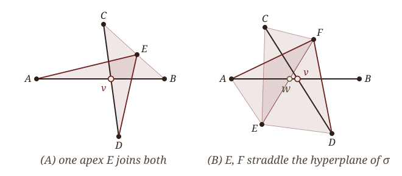

# § I.  The Shadow and Its Obstruction {.section-divider}

::: {.plate data-plate="I"}

:::

::: {.notes}
Section one: what the shadow is, and the theorem that says it usually fails.
:::


## Where is the shape?

::: {.standfirst .math}
A sample $\mathcal S\subset\mathbb R^N$ lies near an unknown shape $\mathcal G\subset\mathbb R^N$. Vietoris–Rips complexes recover *what* $\mathcal G$ is. They do not say *where* it is.
:::

::: {.definition data-num="1" data-name="Vietoris–Rips complex"}
For a metric space $(\mathcal S,d)$ and a scale $\beta>0$, $\mathcal R_\beta(\mathcal S)$ is the abstract simplicial complex with a simplex for every finite $\sigma\subseteq\mathcal S$ of diameter $<\beta$. It is a flag complex: determined by its edges.
:::

::: {.rmk data-name="What is known"}
For many classes of shapes, $\mathcal R_\beta(\mathcal S)\simeq\mathcal G$ at suitable scales: Hausmann and Latschev for Riemannian manifolds, with quantitative versions for metric graphs, Euclidean submanifolds and spaces of curvature bounded above. But $\mathcal R_\beta(\mathcal S)$ is abstract. It is not a subset of $\mathbb R^N$.
:::

::: {.problem .fragment data-num="2" data-name="Geometric reconstruction"}
From a finite $\mathcal S\subset\mathbb R^N$ with $d_H(\mathcal S,\mathcal G)$ small, compute $\widehat{\mathcal G}\subset\mathbb R^N$ with

1. $\widehat{\mathcal G}\simeq\mathcal G$, and
2. $d_H(\widehat{\mathcal G},\mathcal G)$ small,

at scales stated in explicit quantities of $\mathcal G$.
:::

::: {.notes}
The setting. There is an unknown shape G sitting in R^N (for this talk, an embedded metric graph) and a finite sample S that is Hausdorff-close to it. Both live in the same Euclidean space.

The Vietoris–Rips complex is the standard tool. It is a flag complex, so it costs no more than its edges, and it does not care about the ambient dimension. The reconstruction theory is well developed: Hausmann and Latschev for manifolds, and quantitative versions (explicit windows of scales) for metric graphs, submanifolds and curvature-bounded spaces.

But the Rips complex is an abstract simplicial complex. It tells you the homotopy type; it does not give you a subset of R^N. So the problem for this talk is geometric reconstruction: produce, from the sample alone, a subset of the same R^N that is homotopy equivalent to G and Hausdorff-close to it, with every scale stated explicitly.
:::


## The shadow

::: {.definition data-num="3" data-name="Shadow"}
Let $\mathcal K$ be a simplicial complex with vertices $\mathcal K^{(0)}\subset\mathbb R^N$. The *shadow projection* $p\colon|\mathcal K|\to\mathbb R^N$ sends each vertex to itself and extends linearly over simplices. The *shadow* is
$$
\mathrm{Sh}(\mathcal K)\;=\;p\big(|\mathcal K|\big)\;=\;\bigcup_{\sigma\in\mathcal K}\operatorname{Conv}(\sigma)\;\subset\;\mathbb R^N .
$$
:::

::: {.fig-wide style="width: 70%;"}

:::

::: {.rmk .fragment data-name="The shadow complex"}
$\mathrm{Sh}(\mathcal K)$ is triangulated by a *shadow complex* $\mathrm{SC}(\mathcal K)$ whose vertices are the vertices of $\mathcal K$ and the transverse crossings $p(\sigma)\cap p(\tau)$, where $\dim\sigma+\dim\tau=N$. The question is whether $p$ is a homotopy equivalence.
:::

::: {.notes}
The shadow is the natural remedy. Take a complex whose vertices happen to be points of R^N. The shadow projection sends each vertex to itself and extends linearly. Its image, the union of the convex hulls of the simplices, is the shadow: an explicit polyhedron in R^N.

In the picture: an abstract complex with a triangle and two edges that cross it; its shadow; and a triangulation of the shadow, the shadow complex, whose new vertices (open circles) are the transverse crossings. A crossing of a sigma and a tau in a single point forces their dimensions to add to N. That count is Carathéodory, and it is what makes the whole construction work in R^N and not only in the plane.

The map p is continuous and onto its image. The whole question is whether it is a homotopy equivalence.
:::


## The Euclidean obstruction

::: {.theorem data-num="4" data-cite="Chambers–de Silva–Erickson–Ghrist 2010"}
Let $\mathcal S\subset\mathbb R^N$ be finite and $\mathcal R_\beta(\mathcal S)$ its **Euclidean** Vietoris–Rips complex.

1. If $N=2$, then $p$ is bijective on $\pi_0$ and an isomorphism on $\pi_1$.
2. If $N=2$ and $k\ge2$, then $p_*$ on $\pi_k$ need not be injective.
3. If $N\ge4$, then $p_*$ on $\pi_1$ need not be surjective.
:::

::: {.fig-wide .fragment style="width: 50%; margin-top: 0;"}

:::

::: {.aside-note .fragment}
In $\mathbb R^3$, $p_*$ is onto on $\pi_1$ (Adamaszek–Frick–Vakili 2017). The theory stops at the plane.
:::

::: {.notes}
For the Euclidean Vietoris–Rips complex the picture is understood precisely, and it is discouraging. Chambers, de Silva, Erickson and Ghrist: in the plane the projection is 1-connected, so the fundamental group is right. But already in the plane, higher homotopy is not preserved, and from dimension four on, even the fundamental group can fail. Adamaszek, Frick and Vakili recovered surjectivity on pi_1 in R^3.

The picture is their planar example. Six points on a regular hexagon, at a scale between the short and the long diagonals: every pair is an edge except the three antipodal pairs, so the flag complex is the boundary of an octahedron, a 2-sphere. Its shadow is the solid hexagon, which is contractible. The 2-sphere is crushed flat.

So as a theory of geometric reconstruction, the Euclidean shadow stops at the plane.
:::


## Two ways past the wall

::: {.standfirst .math}
Every statement on the last slide is a theorem about the **Euclidean** metric on the sample.
:::

::: {.env-row}
::: {.theorem data-num="5" data-name="In the limit" data-cite="Kawamura–Majhi–Mitra"}
Let $X\subset\mathbb R^N$ be a compact ANR. For each $\beta>0$ form the direct limit of $\pi_k\big(\mathrm{Sh}(\mathcal R_\beta(S))\big)$ over finite $S\subset X$. As $\beta\to0$, the inverse limit of these groups is isomorphic to $\pi_k(X)$.
:::

::: {.rmk .fragment data-name="At one scale: this talk"}
Keep **one** finite sample and **one** scale. Replace the Euclidean metric on $\mathcal S$ by a path metric $d^{\varepsilon}_{\mathcal S}$ built from its pairwise distances.

The hypotheses of the obstruction are then not met. We decline them; we do not contradict them.
:::
:::

::: {.aside-note .fragment}
The shape-theoretic route says the limit exists. The question here is when a fixed sample is already there, and at which explicit scale.
:::

::: {.notes}
Here is the hinge of the talk. Everything on the previous slide is a theorem about the Euclidean metric. The counterexamples are built out of Euclidean distances.

There are two ways past it. The first is the one Kazuhiro just presented: let the scale go to zero and study the shadows as an inverse system. Shape theory then recovers the homotopy groups of any compact ANR. It is a geometric Latschev theorem, and it is qualitative.

The second is this talk. Keep one finite sample, at one scale, and change the metric on the sample. Chambers et al. remain true; their hypothesis is simply not met. We are not contradicting them; we are declining their hypothesis.

So the question Kazuhiro's theorem leaves, when does the limit stabilize, gets an answer for embedded graphs, in every ambient dimension, with explicit constants.
:::


# § II.  Change the Metric {.section-divider}

::: {.plate data-plate="II"}

:::

::: {.notes}
Section two: the path metric, what it buys at the level of the abstract complex, and a combinatorial condition that makes the shadow faithful on pi_1 without ever mentioning the dimension.
:::


## The $\varepsilon$-path metric

::: {.env-row}
::: {.definition data-num="6" data-name="Path metric"}
For $\mathcal A\subset\mathbb R^N$ and $\varepsilon>0$, an *$\varepsilon$-path* from $p$ to $q$ is a chain $p=a_0,a_1,\dots,a_{k+1}=q$ in $\mathcal A$ with $\|a_i-a_{i+1}\|<\varepsilon$. Set
$$
d^\varepsilon_{\mathcal A}(p,q)=\inf\ \sum_i\|a_i-a_{i+1}\| ,
$$
and write $\mathcal R^\varepsilon_\beta(\mathcal S)$ for the Vietoris–Rips complex of $(\mathcal S,d^\varepsilon_{\mathcal S})$.
:::

::: {.proposition .fragment data-num="7" data-name="Comparison" data-cite="Majhi 2023"}
If $d_H(\mathcal S,\mathcal G)<\tfrac12\xi\varepsilon$ with $\xi\in(0,1)$, and $\|a-A\|,\|b-B\|<\tfrac12\xi\varepsilon$ for $a,b\in\mathcal G$, $A,B\in\mathcal S$, then
$$
\|A-B\|\;\le\;d^\varepsilon_{\mathcal S}(A,B)\;\le\;\frac{d_{\mathcal G}(a,b)+\xi\varepsilon}{1-\xi}.
$$
:::
:::

::: {.fig-wide .fragment style="width: 62%;"}

:::

::: {.notes}
The replacement metric. An epsilon-path hops through the sample in steps shorter than epsilon; the epsilon-path distance is the shortest such chain. It is computed from pairwise Euclidean distances alone, so it needs no knowledge of G: build the epsilon-neighborhood graph and run shortest paths.

The comparison proposition says what it measures: up to the factor 1/(1-xi) and an additive xi epsilon, it is the intrinsic distance along the graph. It never undercuts the Euclidean distance.

The picture is the whole point. A hairpin: two legs of the same arc, close in R^N and far along the arc. The Euclidean Rips complex at this scale bridges the gap and fills in a disk. The path-metric Rips complex on the same points, at the same beta, does not: across the gap the path distance is the length of the detour. Both complexes are computed from the sample, not drawn.
:::


## What we import: the abstract complex

::: {.theorem data-num="8" data-name="Homotopy reconstruction" data-cite="Komendarczyk–Majhi–Mitra, JACT"}
[Let $\mathcal G\subset\mathbb R^N$ be a compact, connected metric graph. Fix $\xi\in(0,\tfrac14)$, let $0<\beta<\tfrac14\ell(\mathcal G)$, and choose $0<\varepsilon\le\tfrac13\beta$ with $\delta^\varepsilon_\beta(\mathcal G)\le\tfrac{1+2\xi}{1+\xi}$.]{.hyp} If $d_H(\mathcal G,\mathcal S)<\tfrac12\xi\varepsilon$, then
$$
\mathcal R^\varepsilon_\beta(\mathcal S)\;\simeq\;\mathcal G .
$$
:::

::: {.env-row}
::: {.rmk data-name="The constants"}
$\ell(\mathcal G)$ is the girth, the length of a shortest simple cycle. $\delta^\varepsilon_\beta(\mathcal G)$ is a large-scale distortion of $\mathcal G$ against its $\varepsilon$-thickening; it tends to $1$ as $\varepsilon\to0$.
:::

::: {.rmk .fragment data-name="The boundary"}
No condition on the angles at vertices: cusps are allowed. The homotopy type of the **abstract** complex is theirs. The **shadow**, in every $N$, is what follows.
:::
:::

::: {.notes}
What we import rather than prove. For the abstract path-metric Rips complex the homotopy type is already known, in any ambient dimension: this is Komendarczyk, Majhi and Mitra. The hypotheses are the girth, the shortest cycle, and a large-scale distortion that tends to one as epsilon shrinks, so a small enough epsilon always exists.

Note what it does not need: no condition at all on the angles at vertices. Cusps, where two edges leave a vertex tangentially, are fine.

That paper also has a shadow theorem, but only in the plane. The homotopy half went to R^N; the shadow half stayed in R^2. That asymmetry is exactly the target of this talk.
:::


## The lifting condition

::: {.definition data-num="9" data-name="Lifting condition"}
$\mathcal K$ with $\mathcal K^{(0)}\subset\mathbb R^N$ satisfies the *lifting condition* if whenever $p(\sigma)$ and $p(\tau)$ meet transversely, with $\sigma=[A_0A_1\cdots A_{N-1}]$ and $\tau=[CD]$, one of the following holds:

\(A) some $E\in\mathcal K^{(0)}$ has $\sigma\cup\{E\}\in\mathcal K$ and $[CDE]\in\mathcal K$;

\(B) some $E,F\in\mathcal K^{(0)}$ have $\tau\cup\{E,F\}\in\mathcal K$ and $[A_0EF]\in\mathcal K$, and the segment $EF$ meets $\operatorname{Conv}(\sigma)$.
:::

::: {.fig-row}
::: {.fig style="flex-basis: 56%;"}

:::

::: {.stmts}
::: {.rmk .fragment}
A transverse crossing in a point forces $\dim\sigma+\dim\tau=N$. For the Euclidean complex in the plane, (A) is automatic: take $E$ the endpoint nearest the crossing.
:::
:::
:::

::: {.notes}
Now the abstract engine: a purely combinatorial condition on a complex with vertices in R^N.

Whenever the image of an (N-1)-simplex sigma and the image of an edge CD cross in a point, we ask the complex to contain a way around the crossing. Either a single vertex E is joined to both, case A, a common apex for the two simplices; or a pair E, F straddles the hyperplane of sigma, with EF actually passing through the hull of sigma, and the two simplices A_0EF and CDEF are present, case B.

In the plane, sigma is an edge AB, and case B says the segment EF crosses AB, as in the right-hand picture. For the Euclidean Rips complex in the plane, case A always holds, which is one way to read the Chambers et al. planar theorem.
:::


## Lifting gives $\pi_1$-surjection, in any dimension

::: {.proposition data-num="10" data-name="Surjection"}
If $\mathcal K$ satisfies the lifting condition, then $p_*\colon\pi_1\big(|\mathcal K|\big)\to\pi_1\big(\mathrm{Sh}(\mathcal K)\big)$ is surjective.
:::

::: {.sketch .fragment}
Represent a loop in $\mathrm{Sh}(\mathcal K)$ by an edge-path in $\mathrm{SC}(\mathcal K)$ whose interior vertices are vertices of $\mathcal K$ or transverse crossings; Steiner points are pushed off by convexity. At a crossing $v\in p(\sigma)\cap p(\tau)$, replace the detour $A_0\,v\,D$ by an edge-path of $\mathcal K$:

in case (A), $\;A_0ED\simeq A_0vED\simeq A_0vD$;

in case (B), with $w\in EF\cap\operatorname{Conv}(\sigma)$, $\;A_0FD\simeq A_0wFD\simeq A_0wvFD\simeq A_0wvD\simeq A_0vD$.

Each homotopy is carried out inside a single $\operatorname{Conv}(\rho)$, $\rho\in\mathcal K$, which is convex.
:::

::: {.aside-note .fragment}
No step refers to $N$. The dimension enters only through which pairs $(\sigma,\tau)$ can cross.
:::

::: {.notes}
And the proposition that makes the condition worth having. If a complex satisfies the lifting condition, the shadow projection is onto on pi_1.

The proof is short. Take a loop in the shadow as an edge-path in the shadow complex. Its interior vertices are either honest vertices of K or transverse crossings. At each crossing v we have a detour A_0, v, D that does not come from K, and the lifting condition hands us a replacement through E, or through F, that does. Every homotopy in the chain happens inside the convex hull of one simplex of K, and convex sets are contractible, so paths with the same endpoints are homotopic there.

That is the observation doing all the work, and nothing in it mentions N. The dimension only decides which pairs can cross; the argument is the same in every dimension.
:::


# § III.  Certified Reconstruction {.section-divider}

::: {.plate data-plate="III"}

:::

::: {.notes}
Section three: the lifting condition is a statement about a complex, but a practitioner has a sample. We need a sampling parameter that certifies it, and then the main theorem.
:::


## Hypotheses, and the condition number

::: {.definition data-num="11" data-name="Hypotheses and constants"}
$\mathcal G\subset\mathbb R^N$ is an embedded metric graph with

(A1) compact, connected, finitely many edges; (A2) two edges share at most one vertex; (A3) each open edge is $C^1$; (A4) incident edges meet at an angle in $(0,\pi]$.

Its constants: the girth $\ell(\mathcal G)$; the shortest edge $\lambda(\mathcal G)$; the global distortion $\delta(\mathcal G)=\sup d_{\mathcal G}(x,y)/\|x-y\|<\infty$; the sharpest angle $\theta_{\min}$; and the *condition number* $\Theta(\mathcal G)\in[\tfrac12,1)$, a maximum over vertices of squared cosines of half-angles between incident tangents, equal to $\cos^2(\theta_{\min}/2)$ when attained at an angle.
:::

::: {.rmk .fragment data-name="What is and is not new"}
(A4) excludes cusps, and it gives $\mathcal G$ positive $\mu$-reach; we claim no larger class of graphs. The advance is in the ambient dimension, and in the output: an explicit polyhedron assembled from the sample, not an offset of a set one does not know.
:::

::: {.notes}
From here on everything is stated in quantities of G alone. The hypotheses are mild: finitely many edges, C^1 edges, and at each vertex no two incident edges leave in the same direction.

The constants: the girth, the shortest edge, the global distortion (the ratio of graph distance to Euclidean distance, finite under A1 to A4), the sharpest angle, and the condition number Theta. Theta lives in [1/2, 1): it is 1/2 for a graph whose sharpest angle is a right angle or wider, and it tends to 1 as two incident edges become tangent.

One remark, to answer a question before it is asked. Assumption A4 does imply positive mu-reach for G. So the advance is not in the class of graphs. It is in the ambient dimension, and in what the output is: mu-reach methods return an offset or level set of a distance function to a shape you do not know, whereas the shadow is an explicit polyhedron built from convex hulls of the sample you have.
:::


## The shadow radius

::: {.definition data-num="12" data-name="Shadow radius"}
$\Delta(\mathcal G)$ is the supremum of $r>0$ such that (A) short subsets of one edge have short geodesic hulls, and (B) whenever finite $\sigma=\{a_0,\dots,a_m\},\tau\subset\mathcal G$ have $\operatorname{diam}_{\mathcal G}\le r$ and $\operatorname{Conv}(\sigma)^{\eta}\cap\operatorname{Conv}(\tau)\neq\emptyset$ for some $\eta\le r$, either

(B1) their geodesic hulls meet: $\operatorname{Conv}_{\mathcal G}(\sigma)\cap\operatorname{Conv}_{\mathcal G}(\tau)\neq\emptyset$; or

(B2) every $q\in\operatorname{Conv}_{\mathcal G}(\tau)$ within $\varepsilon\le\tfrac12(1-\Theta)^{3/2}r$ of the affine hull of $\sigma$ has
$\displaystyle\min_i d_{\mathcal G}(a_i,q)\le\tfrac{1+\Theta}{2}\operatorname{diam}_{\mathcal G}(\sigma)+\tfrac{2\varepsilon}{1-\Theta}.$
:::

::: {.env-row}
::: {.proposition .fragment data-num="13" data-name="Positivity"}
Under (A1)–(A4), $\Delta(\mathcal G)>0$. For Lipschitz tangents with constant $L$, $\Delta(\mathcal G)\ge c\,\min\big\{\tfrac13\ell(\mathcal G),\ \tfrac{1-\Theta}{12L}\big\}$; for straight edges it is a finite computation in the angles.
:::

::: {.example .fragment data-num="14" data-name="Three prongs"}
Unit prongs at $120^\circ$: $\Theta=\tfrac12$, $\Delta\le0.15$. Squeezed to a sharpest angle of $28.6^\circ$: $\Theta=0.939$, $\Delta\le0.05$.
:::
:::

::: {.notes}
The certificate on the sampling side. In words: at scales below the shadow radius, if the Euclidean hulls of two small pieces of the graph meet (or come within a tolerance eta, which is how the noise enters), then either their geodesic hulls already meet, or the meeting happens near a vertex in a controlled way: a point of tau near the affine hull of sigma is close along the graph to one of the points of sigma. The factor (1+Theta)/2 is less than one, and that is what the argument consumes; it degrades exactly as two incident edges become tangent.

The shadow radius is positive under A1 to A4, and it is quantitative: linear in 1 - Theta for Lipschitz tangents, and a finite computation in the angles for polygonal graphs, which is the case most likely to arise in practice.

For a feel for the numbers: a three-pronged star with unit prongs at 120 degrees, versus the same star squeezed until the sharpest angle is under 30 degrees. Sharper vertices, smaller shadow radius.
:::


## The shadow radius certifies the lifting condition

::: {.lemma data-num="15" data-name="Certification"}
[Under the hypotheses of the main theorem,]{.hyp} $\mathcal R^\varepsilon_\beta(\mathcal S)$ satisfies the lifting condition. Hence $p_*$ is onto on $\pi_1$.
:::

::: {.sketch .fragment}
If the hulls of $\sigma,\tau\subset\mathcal S$ meet, project to $\mathcal G$ by a nearest-point map $\Psi$; the projected hulls come within $\xi\varepsilon$. Below $\Delta(\mathcal G)$, alternative (B1) produces the apex $E$ of case (A), and (B2) produces a pair $E,F$ separated by the hyperplane of $\sigma$. The factor $\tfrac{1+\Theta}{2}<1$, pushed through the comparison of metrics, keeps $[A_0EF]$ below scale $\beta$.
:::

::: {.lemma .fragment data-num="16" data-name="Injectivity"}
[Under the same hypotheses,]{.hyp} $p_*$ is injective on $\pi_k$ for every $k\ge0$.
:::

::: {.sketch .fragment}
Extend $\Psi$ to a simplicial map $\Psi'\colon\mathrm{SC}\big(\mathcal R^\varepsilon_\beta(\mathcal S)\big)\to\mathcal R_{3K\beta}(\mathcal G)$ with $\Psi'\circ p\simeq\Psi$, using $K<1.08$. Since $3K\beta<\tfrac13\ell(\mathcal G)$, $\Psi$ is injective on homotopy groups, so $p$ is.
:::

::: {.notes}
The two lemmas that carry the main theorem.

Certification: the path-metric Rips complex of a sample satisfies the lifting condition. Take two simplices whose Euclidean hulls cross. Project to the graph; the projected hulls come within xi epsilon of each other, which is why the shadow radius carries a tolerance. Below the shadow radius, either the geodesic hulls meet, and that gives a common vertex E, case A, or we are near a vertex and (B2) gives a pair E, F on opposite sides of the hyperplane of sigma, case B. The only real work is to show that A_0EF is a simplex at scale beta, and that is exactly where (1+Theta)/2 < 1 is spent.

Injectivity is cheaper. The nearest-point map extends over the shadow complex to a Rips complex of the graph at scale about 3.2 beta, and at that scale, below a third of the girth, it is injective on homotopy groups. This is why the main theorem assumes beta below one tenth of the girth.
:::


## Geometric reconstruction

::: {.theorem data-num="17" data-name="Geometric reconstruction" data-cite="Majhi–Mitra"}
[Let $\mathcal G\subset\mathbb R^N$ satisfy (A1)–(A4); fix $\xi\in\big(0,\tfrac{1-\Theta}{6}\big)$; let $\beta<\min\{\Delta(\mathcal G),\tfrac{1}{10}\ell(\mathcal G)\}$ with $\beta\le\tfrac{\ell(\mathcal G)}{1+8\delta(\mathcal G)}$; and let $\varepsilon\le\tfrac{(1-\Theta)(1-\Theta-6\xi)}{12}\beta$, small enough in terms of $\delta(\mathcal G)$ and $\delta^\varepsilon_\beta(\mathcal G)$.]{.hyp} If $\mathcal S\subset\mathbb R^N$ is compact with $d_H(\mathcal S,\mathcal G)<\tfrac12\xi\varepsilon$, then

1. $p$ is bijective on $\pi_0$, an isomorphism on $\pi_1$, and injective on every $\pi_k$;
2. $d_H\big(\mathrm{Sh}(\mathcal R^\varepsilon_\beta(\mathcal S)),\,\mathcal G\big)<\beta+\tfrac12\xi\varepsilon$;
3. if $N=2$, or if the shadow is aspherical, then $\mathrm{Sh}(\mathcal R^\varepsilon_\beta(\mathcal S))\simeq\mathcal G$.
:::

::: {.corollary .fragment data-num="18" data-name="Controlled inverses"}
When (3) holds, there are homotopy inverses $f\colon\mathcal G\to\mathrm{Sh}$ and $h\colon\mathrm{Sh}\to\mathcal G$ with $\sup\|f(g)-g\|\le2\varepsilon$ and $\sup\|h(x)-x\|\le8\beta$.
:::

::: {.aside-note .fragment}
The asymmetry is forced: the shadow is genuinely $\beta$-thick near a vertex.
:::

::: {.notes}
Assembling. Grey is the fine print; the claims are in black.

For a graph satisfying A1 to A4, the hypotheses produce an explicit window: beta below the shadow radius and a tenth of the girth, epsilon a fixed fraction of beta, and a sample within half xi epsilon. Then, in any ambient dimension: the shadow projection is a bijection on components, an isomorphism on fundamental groups, and injective on all homotopy groups; and the shadow lies within beta plus a hair of G.

In the plane that is the whole story: planar sets are aspherical, by Cannon, Conner and Zastrow, so pi_1-isomorphism gives a homotopy equivalence. And it comes with controlled inverses: G moves into the shadow by at most 2 epsilon, the shadow moves back by at most 8 beta. The asymmetry is not an artifact. Two samples on perpendicular edges at arclength beta/3 span a chord whose midpoint sits about beta/6 off the graph. Note also that the sample is only Hausdorff-close, so this contains the earlier planar theorem.

In higher dimensions, (3) needs asphericity of the shadow, and we do not know it. That is the next slide.
:::


## In $\mathbb R^N$: a two-scale form

::: {.theorem data-num="19" data-name="Two-scale reconstruction" data-cite="Majhi–Mitra"}
[Assume also $8\beta\le(1-\Theta)^{3/2}\Delta(\mathcal G)$ and $\beta'=\tfrac{36}{1-\Theta}\beta<\tfrac14\ell(\mathcal G)$. Write $\mathrm{Sh}_\beta=\mathrm{Sh}(\mathcal R^\varepsilon_\beta(\mathcal S))$.]{.hyp} There are maps $h\colon\mathrm{Sh}_\beta\to\mathcal G$ and $f'\colon\mathcal G\to\mathrm{Sh}_{\beta'}$ such that the inclusion $j$ factors through $\mathcal G$ up to homotopy:
$$
j\;\simeq\;f'\circ h\colon\ \mathrm{Sh}_\beta\;\xrightarrow{\;h\;}\;\mathcal G\;\xrightarrow{\;f'\;}\;\mathrm{Sh}_{\beta'} .
$$
Hence $j_*=0$ on $\pi_k$ for $k\ge2$, and $j_*\,\pi_1(\mathrm{Sh}_\beta)=f'_*\,\pi_1(\mathcal G)$.
:::

::: {.env-row}
::: {.sketch .fragment}
Hulls that meet have $d^\varepsilon$-diameter at most $\tfrac{9}{1-\Theta}\beta$. This gives a simplicial map $\mathrm{SC}(\mathcal R^\varepsilon_\beta)\to\mathcal R^\varepsilon_{\beta'}$ commuting with both projections up to homotopy; compose with $\mathcal R^\varepsilon_{\beta'}(\mathcal S)\simeq\mathcal G$.
:::

::: {.rmk .fragment data-name="Every surviving feature is real"}
Spheres die between the two scales, and the surviving fundamental group is exactly that of $\mathcal G$. The factor $\tfrac{36}{1-\Theta}$ is crude; what matters is that it is explicit.
:::
:::

::: {.notes}
Rather than leave the higher-dimensional statement conditional on asphericity, we prove an unconditional two-scale form, of the same species as the interleavings of persistence.

Take a second scale beta', a fixed multiple of beta depending only on Theta. The inclusion of the small shadow into the large one factors through the graph, up to homotopy. So any sphere in the small shadow dies in the large one, and the part of the fundamental group that survives is exactly pi_1 of G.

The engine is a union-diameter estimate: two simplices whose hulls meet have union of path-metric diameter at most 9/(1-Theta) times beta. That lets us map the shadow complex simplicially into the Rips complex at scale beta', compatibly with both shadow projections, and the Rips complex at beta' is homotopy equivalent to G by the imported theorem.

The constant 36/(1-Theta) is crude and surely improvable. The single-scale question, whether the shadow is itself aspherical for N at least 3, stays open.
:::


# § IV.  Beyond Homotopy Type {.section-divider}

::: {.plate data-plate="IV"}

:::

::: {.notes}
Section four. For graphs, homotopy type is weak: it sees only the first Betti number, so a theta graph and a wedge of two circles are indistinguishable. So we extract from the shadow a 1-complex homeomorphic to G.
:::


## Reading the degree off the sample

::: {.definition data-num="20" data-name="Degree, clusters, arcs"}
For $A\in\mathcal S$ let $\deg_\beta(A)$ be the number of components of the $\varepsilon$-graph on the annulus
$$
\big\{B\in\mathcal S:\ \tfrac12\beta\le d^\varepsilon_{\mathcal S}(A,B)\le\beta\big\}.
$$
Let $\mathcal V=\{A:\deg_\beta(A)\ne2\}$; its *clusters* join points at $d^\varepsilon$-distance $\le3\beta$. Delete the $\beta$-neighborhood of $\mathcal V$; the remaining components are the *arcs*. $C(\mathcal S,\beta,\varepsilon)$ has a vertex per cluster and an edge per arc, drawn as a shortest $\varepsilon$-path.
:::

::: {.fig-row}
::: {.fig style="flex-basis: 56%;"}

:::

::: {.stmts}
::: {.rmk .fragment data-name="Whose device"}
The degree statistic is that of Aanjaneya, Chazal, Chen, Glisse, Guibas and Morozov (2012) for abstract metric graphs. New here: the output is embedded, $C\subset\mathrm{Sh}(\mathcal R^\varepsilon_\beta(\mathcal S))$, and the scales are certified.
:::
:::
:::

::: {.notes}
The construction is not ours, and I want to say so clearly: counting components of a punctured neighborhood to find branch points is the device of Aanjaneya, Chazal, Chen, Glisse, Guibas and Morozov, whose statistical behavior Lecci, Rinaldo and Wasserman analyzed.

For each sample point, look at the annulus between beta/2 and beta in the path metric and count its components. On an edge, two. At a branch vertex, the degree. Points with count other than two are clustered into branch vertices; removing their neighborhoods leaves the arcs, which become edges.

What is different is the setting. Their input is an abstract metric space and their output an abstract graph. Ours is a sample in R^N, and the output is drawn from edges of the Rips complex, so it sits inside the shadow, in the same R^N, and we can certify the scales at which it is right.
:::


## Homeomorphic reconstruction

::: {.theorem data-num="21" data-name="Homeomorphic reconstruction" data-cite="Majhi–Mitra"}
[Assume the hypotheses of the main theorem, and]{.hyp}
$$
\frac{1}{1-\xi}\Big[\frac{\varepsilon}{\sin(\theta_{\min}/2)}+3\xi\varepsilon\Big]\;<\;\beta\;<\;\frac{\lambda(\mathcal G)}{6}.
$$
Then $C(\mathcal S,\beta,\varepsilon)$ is homeomorphic to $\mathcal G$, and $d_H\big(C(\mathcal S,\beta,\varepsilon),\mathcal G\big)<\beta+\tfrac12\xi\varepsilon$.
:::

::: {.env-row}
::: {.rmk .fragment data-name="The window closes from below"}
Two branches at angle $\theta$ are a chord $2r\sin(\theta/2)$ apart at arclength $r$, and must be more than $\varepsilon$ apart at $r=\tfrac12\beta$. Sharper angles force *larger* $\beta$. The window is non-empty once $\varepsilon<\tfrac12\sin(\tfrac12\theta_{\min})\min\{\Delta,\tfrac{1}{10}\ell,\tfrac16\lambda\}$.
:::

::: {.rmk .fragment data-name="Homeomorphic is not isotopic"}
In $\mathbb R^3$ a graph may be knotted; homeomorphism at small Hausdorff distance does not recover the embedding class. For $N\ge3$ a small perturbation makes $C$ embedded; in the plane its arcs may cross.
:::
:::

::: {.notes}
The theorem: in a two-sided window of scales, the extracted complex is homeomorphic to G and within the same Hausdorff distance.

The right end is simple: beta below a sixth of the shortest edge keeps the neighborhoods of distinct vertices apart and leaves a piece of every edge outside them.

The left end is the interesting one, and it has no counterpart in the abstract metric setting, because it is Euclidean geometry at a vertex. Two branches leaving a vertex at angle theta are a chord 2r sin(theta/2) apart at arclength r. For the annulus to see them as two components at r = beta/2, that chord must exceed epsilon. So the window closes from below: sharper angles require larger beta, because nearly parallel branches stay close for longer. Sharp vertices are the hard case from both sides, since the shadow radius also shrinks.

And a caveat: homeomorphic is not isotopic. A knotted graph in R^3 is recovered up to homeomorphism, not up to its embedding.
:::


## Two consequences

::: {.corollary data-num="22" data-name="Effective stability"}
[Let $\mathcal G_1,\mathcal G_2\subset\mathbb R^N$ satisfy (A1)–(A4), and let $\xi,\beta,\varepsilon$ be admissible for both in the homeomorphic theorem.]{.hyp} If $d_H(\mathcal G_1,\mathcal G_2)<\tfrac12\xi\varepsilon$, then $\mathcal G_1\cong\mathcal G_2$.
:::

::: {.sketch .fragment}
A fine finite sample $\mathcal S$ of $\mathcal G_2$ lies within $\tfrac12\xi\varepsilon$ of both graphs, and $C(\mathcal S,\beta,\varepsilon)$ depends on $\mathcal S$ alone: it is homeomorphic to each.
:::

::: {.proposition .fragment data-num="23" data-name="Checking is cheaper than building"}
For $\mathcal K$ on $n$ points of $\mathbb R^N$, the lifting condition can be verified in $O(n^{N+4})$ time, up to an $O(N^3)$ factor: polynomial in $n$ for fixed $N$, without constructing the shadow. Building $\mathrm{Sh}(\mathcal K)$ explicitly needs the $(N-1)$-skeleton, $O(n^N)$ simplices, and an arrangement of their hulls.
:::

::: {.aside-note .fragment}
The theory is dimension-free: no constant above depends on $N$. The computation is not.
:::

::: {.notes}
Two consequences.

First, an effective stability statement. The complex C depends only on the sample and the two scales. So if two graphs are both admissible at the same scales and Hausdorff-closer than half xi epsilon, one fine sample of either is close enough to both, and C is homeomorphic to each of them. The radius is computed from the geometry of the two graphs: angles, shadow radius, girth, shortest edge. Note that these graphs have zero reach at every corner, so reach-based stability does not apply to them.

Second, the cost. The theorem certifies a complex; checking its hypothesis, the lifting condition, is polynomial in the sample size for fixed N: enumerate the crossing pairs, each an N by N linear system, and search for the E or the pair E, F. Building the shadow itself is more expensive, since it needs the (N-1)-skeleton. So: the theory is dimension-free, and every constant is insensitive to N; the computation is not. The two should not be conflated.
:::


# § V.  The Apex Condition {.section-divider}

::: {.plate data-plate="V"}

:::

::: {.notes}
The last section is work in preparation with Kazuhiro Kawamura and Atish Mitra: a second combinatorial condition, stronger than lifting, whose payoff is a homotopy equivalence without asphericity.
:::


## The apex condition

::: {.env-row}
::: {.definition data-num="24" data-name="Apex condition"}
For $x\in\mathrm{Sh}(\mathcal K)$ let $\mathrm{st}(x,\mathcal K)$ be the subcomplex generated by $\{\sigma\in\mathcal K: x\in\operatorname{Conv}(\sigma)\}$. $\mathcal K$ satisfies the *apex condition* if every $x$ has a vertex $v_x$ with
$$
v_x\ast\mathrm{st}(x,\mathcal K)\subseteq\mathcal K ,
$$
that is, $\sigma\cup\{v_x\}\in\mathcal K$ whenever $x\in\operatorname{Conv}(\sigma)$.
:::

::: {.proposition .fragment data-num="25" data-name="Homotopy equivalence" data-cite="Kawamura–Majhi–Mitra, in prep."}
If $\mathcal K$ is a flag complex satisfying the apex condition, then $p\colon|\mathcal K|\to\mathrm{Sh}(\mathcal K)$ is a homotopy equivalence, in every ambient dimension.
:::
:::

::: {.fig-row}
::: {.fig style="flex-basis: 30%;"}

:::

::: {.stmts}
::: {.sketch .fragment}
Order the vertices and take the least apex. Flagness makes apices of nested shadow simplices span a simplex, so $x\mapsto v_x$ gives a simplicial map $\operatorname{sd}\mathrm{SC}(\mathcal K)\to\mathcal K$; straight-line homotopies inside convex hulls make it a homotopy inverse to $p$.
:::

::: {.rmk .fragment data-name="The hexagon has no apex"}
At the center, $\mathrm{st}(x)$ contains $[135]$ and $[246]$; an apex would be joined to all six vertices, but each vertex misses its antipode.
:::
:::
:::

::: {.notes}
The apex condition asks for more than lifting. At every point x of the shadow, gather all the simplices whose hulls contain x; the condition asks for one vertex, the apex, joined to all of them at once.

The payoff: for a flag complex, the apex condition makes the shadow projection a homotopy equivalence, in every dimension, with no asphericity and no sample in sight. The proof picks the least apex under a vertex order; flagness makes the choices compatible along chains of shadow simplices, so the apex map is simplicial on the subdivided shadow complex, and straight-line homotopies inside convex hulls show it is a homotopy inverse.

It is also exactly what fails in the Chambers et al. hexagon: at the center both big triangles cover x, so an apex would have to see all six vertices, and every vertex misses its antipode. So the example that kills the Euclidean theory is a non-example of the condition, as it should be.
:::


## Toward knots, and back to graphs

::: {.conjecture data-num="26" data-cite="Kawamura–Majhi–Mitra"}
Let $M\subset\mathbb R^N$ be a smooth simple closed curve. For all sufficiently small $\beta>0$ and every finite $S$ sufficiently Hausdorff-close to $M$, the shadow of the **Euclidean** complex satisfies $\mathrm{Sh}(\mathcal R_\beta(S))\simeq M$.
:::

::: {.rmk .fragment data-name="The route, and where it stands"}
For $S\subset M$ it would follow from one proposition, not yet proved: that $\mathcal R_\beta(S)$ satisfies the apex condition for $\beta$ below the reach $\tau(M)$. With it, the shadow is $\simeq M$ and within $\beta+\zeta$ of $M$ in the Hausdorff distance. Recovering the *knot type* then asks for a curve in the shadow, deformation retract and ambient isotopic to $M$.
:::

::: {.question .fragment data-num="27" data-name="Back to graphs"}
Under the hypotheses of the main theorem, does $\mathcal R^\varepsilon_\beta(\mathcal S)$ satisfy the apex condition? A yes gives $\mathrm{Sh}(\mathcal R^\varepsilon_\beta(\mathcal S))\simeq\mathcal G$ at a single scale, in every $N$.
:::

::: {.notes}
Where the apex condition is meant to go. For a knot, a smooth closed curve, the conjecture is that the plain Euclidean shadow is already right at small scales, and the route is clear: show that the Euclidean Rips complex of a sample on the curve satisfies the apex condition below the reach. That proposition is not yet proved, and I want to be careful to say so: what I am advertising is the condition and the general homotopy equivalence, not the knot theorem.

Beyond homotopy type, the question Kazuhiro asked us is the knot type: find a curve inside the shadow that is a deformation retract and is embedded like M.

And the question for this talk: does our path-metric complex satisfy the apex condition under the main theorem's hypotheses? If yes, the two-scale statement becomes a single-scale homotopy equivalence in every dimension. The lifting and apex conditions are not known to be comparable.
:::


## What is open

::: {.question data-num="28" data-name="Asphericity"}
For $N\ge3$, is $\mathrm{Sh}(\mathcal R^\varepsilon_\beta(\mathcal S))$ aspherical under the main theorem? Or is there a sample whose shadow has $\pi_2\ne0$?
:::

::: {.question .fragment data-num="29" data-name="Necessity"}
Is the lifting condition, or the apex condition, necessary for $p$ to be a homotopy equivalence?
:::

::: {.question .fragment data-num="30" data-name="Scales from the sample"}
Every constant here belongs to the unknown $\mathcal G$. The degrees are recovered from $\mathcal S$, and for straight edges $\Delta(\mathcal G)$ is a computation in the angles. Can a reconstruction certify its own scales?
:::

::: {.question .fragment data-num="31" data-name="Limits and samples"}
How do these sampling thresholds relate to the scale at which the inverse limit in Kawamura's theorem stabilizes?
:::

::: {.notes}
Four questions for the room.

Asphericity: in dimension three and up, can the shadow carry an essential 2-sphere under our hypotheses? Either answer would be interesting; a discrete Morse collapse of the shadow complex would settle it positively.

Necessity: both conditions are sufficient. Is either necessary? I do not know the smallest configuration that would decide it.

Scales from the sample: like every reach-type theorem, ours is stated in quantities of the unknown shape. But the degree statistic recovers the vertices, and for polygonal graphs the shadow radius is a computation in the angles at the vertices, which the same annuli estimate. A reconstruction that certifies its own scales looks within reach.

And the connection to the previous talk: the limit theorem says the shadows converge; ours says when a fixed sample is already there. Relating the two thresholds is the natural joint question.

Thank you.
:::


## Thank you {.colophon}

```{=html}
<div class="finis">F  I  N  I  S</div>
<svg class="wax-seal" viewBox="0 0 80 80" role="img" aria-label="Author's seal" xmlns="http://www.w3.org/2000/svg">
  <defs>
    <style>
      .seal-ring  { stroke: currentColor; fill: none; stroke-width: 1.3; }
      .seal-inner { stroke: currentColor; fill: none; stroke-width: 0.45; }
      .seal-mark  { fill: currentColor; stroke: none; }
      .seal-thin  { stroke: currentColor; fill: none; stroke-width: 0.55; }
      .seal-mono  { font-family: 'Noto Serif Bengali', 'Bengali Sangam MN', 'Kalpurush', serif; font-weight: 700; font-size: 12px; fill: currentColor; }
      .seal-band  { font-family: 'Alegreya SC', 'EB Garamond', Georgia, serif; font-size: 4.6px; letter-spacing: 0.22em; fill: currentColor; }
    </style>
    <path id="seal-top"    d="M 11 40 A 29 29 0 0 1 69 40" />
    <path id="seal-bottom" d="M 11 40 A 29 29 0 0 0 69 40" />
  </defs>
  <circle class="seal-ring"  cx="40" cy="40" r="36" />
  <circle class="seal-inner" cx="40" cy="40" r="33" />
  <circle class="seal-inner" cx="40" cy="40" r="22" />
  <text class="seal-band"><textPath href="#seal-top" startOffset="50%" text-anchor="middle">SVSHOVAN  MAJHI</textPath></text>
  <text class="seal-band"><textPath href="#seal-bottom" startOffset="50%" text-anchor="middle">·  ANNO  MMXXVI  ·</textPath></text>
  <g>
    <polygon class="seal-mark" opacity="0.16" points="35,33 40,24 40,41" />
    <polygon class="seal-mark" opacity="0.16" points="40,24 45,33 40,41" />
    <g class="seal-thin">
      <line x1="35" y1="33" x2="40" y2="24" /><line x1="40" y1="24" x2="45" y2="33" />
      <line x1="35" y1="33" x2="40" y2="41" /><line x1="45" y1="33" x2="40" y2="41" />
      <line x1="40" y1="24" x2="40" y2="41" /><line x1="35" y1="33" x2="45" y2="33" />
    </g>
  </g>
  <text class="seal-mono" x="40" y="51" text-anchor="middle">সুশোভন</text>
  <g class="seal-mark"><circle cx="40" cy="56" r="0.6" /><circle cx="37" cy="59" r="0.6" /><circle cx="43" cy="59" r="0.6" /></g>
</svg>
```

::: {.contact}
Preprint on the arXiv, October 2026 · [smajhi.com](https://smajhi.com) · [s.majhi@email.gwu.edu](mailto:s.majhi@email.gwu.edu)
:::

::: {.subscription}
*Joint work with* Atish Mitra; the apex condition with Kazuhiro Kawamura and Atish Mitra. AMS Fall Eastern Sectional · Special Session on Advances in Applied Topology · Washington, D.C. · October 3, 2026.
:::
