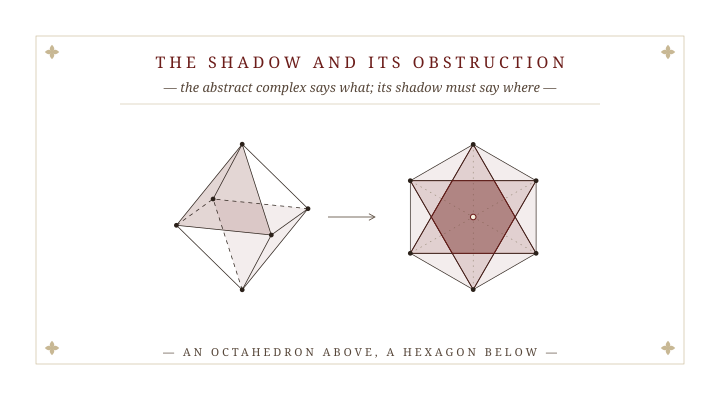
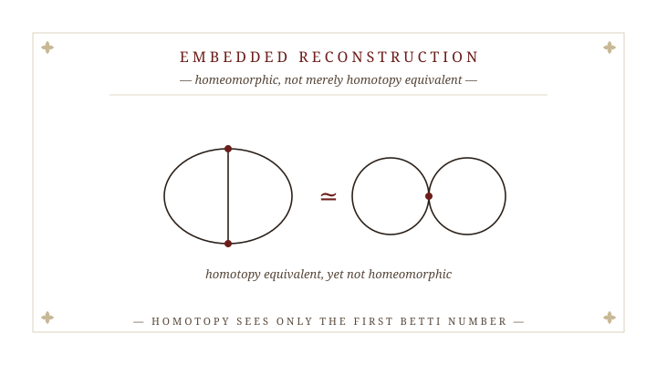
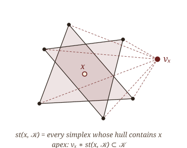
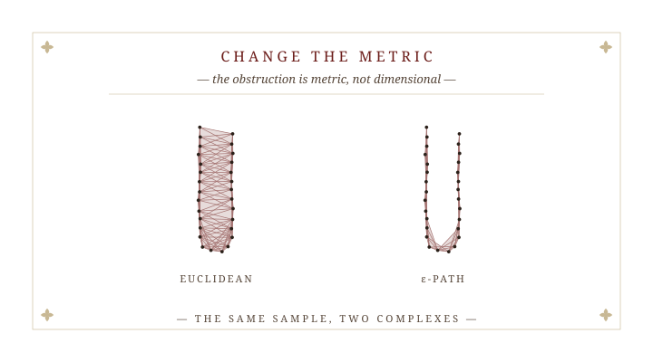
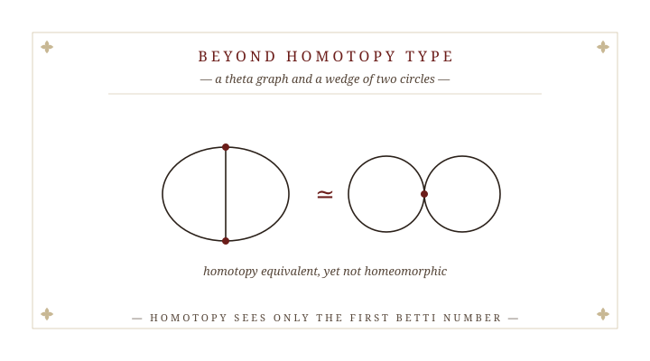
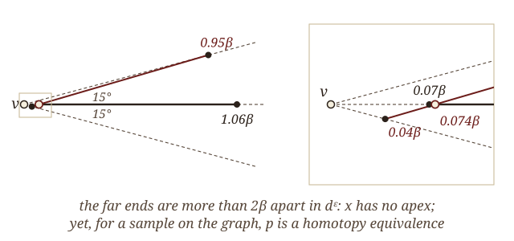
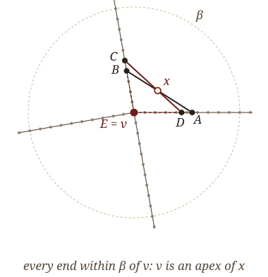

## The question we start from {.opener}

<!-- AMS Washington only: this slide picks up where Kazuhiro Kawamura's talk ends.
     For another venue, hide it: change the heading attribute to {.opener visibility="hidden"}. -->

:::: {.opener-quote}
For finite samples $F$ of a compact ANR $M\subset\mathbb R^N$:

:::: {.chain-stack}
::: {.chain .fragment .fade-out data-fragment-index="1"}
$$
\pi_q\big(\mathrm{Sh}(\mathcal R_\beta(F))\big)
\;\underset{\text{question (a)}}{\overset{?}{\cong}}\;
\varprojlim_{\beta}\ \varinjlim_{F}\ \pi_q\big(\mathrm{Sh}(\mathcal R_\beta(F))\big)
\;\underset{\text{theorem}}{\cong}\;
\pi_q(M)
$$
:::

::: {.chain .chain-abstract .fragment .fade-in-then-out data-fragment-index="1"}
$$
\pi_q\big(\mathcal R_\beta(F)\big)
\;\underset{\text{known, one explicit scale}}{\cong}\;
\varprojlim_{\beta}\ \varinjlim_{F}\ \pi_q\big(\mathcal R_\beta(F)\big)
\;\underset{\text{theorem}}{\cong}\;
\pi_q(M)
$$
:::

::: {.chain .fragment .fade-in data-fragment-index="2"}
$$
\pi_q\big(\mathrm{Sh}(\mathcal R_\beta(F))\big)
\;\underset{\text{question (a)}}{\overset{?}{\cong}}\;
\varprojlim_{\beta}\ \varinjlim_{F}\ \pi_q\big(\mathrm{Sh}(\mathcal R_\beta(F))\big)
\;\underset{\text{theorem}}{\cong}\;
\pi_q(M)
$$
:::
::::

Is **one** dense finite sample $F$, at **one** small scale $\beta$, already enough?
::::

::: {.opener-attrib}
Theorem: Kawamura–Majhi–Mitra · Question (a), stabilization: K. Kawamura, the previous talk
:::

::: {.prior .fragment data-fragment-index="1"}
[Without the shadow, one explicit scale already suffices for the abstract complex $\mathcal R_\beta(F)$:]{.prior-head}

::: {.prior-cards}
::: {.prior-card}
**Riemannian and Euclidean submanifolds**

[Majhi · SoCG 2024 · DCG 2024]{.prior-venue}
:::

::: {.prior-card}
**Metric graphs**

[Majhi · JACT 2023]{.prior-venue}
:::

::: {.prior-card}
**CAT($\kappa$) spaces**

[Komendarczyk–Majhi–Tran · DCG, under review]{.prior-venue}
:::
:::
:::

::: {.opener-answer .fragment data-fragment-index="2"}
**This talk: the shadow.** Embedded graph $\mathcal G\subset\mathbb R^N$, path metric on the sample, every $N$. A sample **on** $\mathcal G$: one explicit scale suffices, $\mathrm{Sh}\simeq\mathcal G$. A sample **near** a polygonal $\mathcal G$: $\pi_q(\mathcal G)\hookrightarrow\pi_q(\mathrm{Sh})$.
:::

::: {.aside-note .fragment data-fragment-index="3"}
The Euclidean question stays open. It is where we end.
:::

::: {.notes}
Kazuhiro ended with a question, and I will start with it. Read the line from the right. His theorem, with Atish and me, is the isomorphism on the right: over all finite samples and as the scale goes to zero, the shadows recover the homotopy groups of the space itself. His question (a) is the one on the left, marked with a question mark: stabilization. When does one dense finite sample, at one small scale, already have the homotopy groups of the space?

[click] Watch the formula: take the shadow away. For the abstract Rips complex itself, one explicit scale is already known to suffice. These are my quantitative Latschev theorems: for Riemannian and Euclidean submanifolds, at SoCG 2024 and in Discrete & Computational Geometry; for metric graphs, in JACT; and, with Komendarczyk and Tran, for spaces of curvature bounded above, CAT(kappa), under review at DCG. Those are exactly the Hausmann-type input his second theorem assumes.

[click] And the shadow comes back: that is this talk. It answers a version of his question, and I want to be precise about the version. Two changes of setting: the shape is an embedded graph, and the metric on the sample is not the Euclidean one but a path metric computed from its pairwise distances. In that setting, in every ambient dimension: for a sample lying on the graph, one explicit scale suffices; the shadow is homotopy equivalent to the graph. For a sample merely near a polygonal graph, we get the injective half.

[click] For the Euclidean complex, his question stays open, and that is where I will end.

(Since Kazuhiro has just defined the shadow and stated Chambers–de Silva–Erickson–Ghrist, the next three slides can go quickly. Budget: about 20 minutes; the live slide is the one place to spend an extra minute.)
:::


# § I.  The Shadow and Its Obstruction {.section-divider}

::: {.plate data-plate="I"}

:::

::: {.notes}
Section one: what the shadow is, and the theorem that says it usually fails.
:::


## Where is the shape?

::: {.standfirst .math}
A sample $\mathcal S\subset\mathbb R^N$ lies near an unknown graph $\mathcal G\subset\mathbb R^N$. Its Vietoris–Rips complex recovers *what* $\mathcal G$ is: it is abstract, so it cannot say *where* $\mathcal G$ is.
:::

{.where-fig}

::: {.definition data-num="1" data-name="Geometric reconstruction"}
A subset of $\mathbb R^N$, built from the sample, that is **homotopy equivalent** to $\mathcal G$ and lies within a fixed multiple of the scale from $\mathcal G$ in the Hausdorff distance.
:::

::: {.rmk .fragment data-name="Not a new class of sets"}
For sets of positive $\mu$-reach, unions of balls and $\alpha$-shapes already are; graph methods return abstract graphs. The question here is about one object: the one a Rips complex gives for free.
:::

::: {.notes}
The setting. An unknown embedded graph G in R^N (road networks, vascular and neuronal trees, fault networks) and a finite sample near it. The Vietoris–Rips complex recovers the homotopy type, but it is abstract: it says what G is, not where.

The picture: on the left the sample; in the middle its Rips complex, the actual complex at this scale, but drawn by a layout that knows only which points are joined, so it sits nowhere in particular. It knows there is one loop and one tail. On the right a subset of the plane itself, around the graph: that is what we want.

So we ask for a geometric reconstruction: a subset of the same R^N, built from the sample, homotopy equivalent to G and Hausdorff-close to it at the scale of the construction.

These exist in other settings, for sets of positive mu-reach, and graphs like ours have positive mu-reach in the plane, so: no advance in the class of sets. The question is about a specific object, the one that comes with a Rips complex for free.
:::


## The shadow

::: {.definition data-num="2" data-name="Shadow"}
Let $\mathcal K$ be a simplicial complex with vertices in $\mathbb R^N$. The *shadow projection* $p\colon|\mathcal K|\to\mathbb R^N$ sends each vertex to itself and extends linearly. The *shadow* is
$$
\mathrm{Sh}(\mathcal K)\;=\;p\big(|\mathcal K|\big)\;=\;\bigcup_{\sigma\in\mathcal K}\operatorname{Conv}(\sigma)\;\subset\;\mathbb R^N .
$$
:::

::: {.fig-wide style="width: 72%; margin: 0.4rem auto 0;"}

:::

::: {.aside-note .fragment}
A polyhedron within the scale of the sample. Does it have the topology of the complex?
:::

::: {.notes}
(If this follows Kazuhiro's talk, say it aloud: his SR of F and epsilon is our Sh of the Rips complex. I write Sh of the complex because we take shadows of complexes other than the Euclidean one.)

The shadow: take a complex whose vertices happen to be points of R^N, send each vertex to itself and extend linearly. The image, the union of the convex hulls of the simplices, is a polyhedron in R^N within the scale of the sample. In the picture: a complex with three pieces and no loop; its shadow is one piece with a loop, cut out by the two segments and the side of the triangle. On the right, a triangulation of the shadow whose new vertices are where images cross.

The question, which is Chambers, de Silva, Erickson and Ghrist's, is whether the shadow has the topology of the complex.
:::


## The Euclidean obstruction

::: {.theorem data-num="3" data-cite="Chambers–de Silva–Erickson–Ghrist 2010"}
Let $\mathcal S\subset\mathbb R^N$ be finite and $\mathcal R_\beta(\mathcal S)$ its **Euclidean** Vietoris–Rips complex.

1. If $N=2$, then $p_*$ is a bijection on $\pi_0$ and an isomorphism on $\pi_1$.
2. If $N=2$ and $k\ge2$, then $p_*$ on $\pi_k$ need not be injective.
3. If $N\ge4$, then $p_*$ on $\pi_1$ need not be surjective.
:::

```{=html}
<div id="shadow-collapse" class="fragment"></div>
<span class="fragment collapse-step" data-collapse="1"></span>
<span class="fragment collapse-step" data-collapse="2"></span>
<span class="fragment collapse-step" data-collapse="3"></span>
```

::: {.aside-note .fragment}
In $\mathbb R^3$, $p_*$ is surjective on $\pi_1$ and its injectivity is open (Adamaszek–Frick–Vakili 2017).
:::

::: {.notes}
(If this follows Kazuhiro's talk, he has just stated these; do not dwell.) In the plane the projection is 1-connected; already in the plane higher homotopy is not preserved; from dimension four on even the fundamental group fails; in R^3 surjectivity on pi_1 is due to Adamaszek, Frick and Vakili, and injectivity there is open.

[click] The picture is their planar example, and it moves. Six points in the plane, on a regular hexagon. [click] Take the Rips complex at a scale between the short and long diagonals: every pair is an edge except the three antipodal pairs, so the flag complex is an octahedron, a 2-sphere. It lives nowhere; I draw it in space. [click] Now let the shadow projection act: every vertex goes back to its point in the plane, and the sphere is flattened onto the solid hexagon, which is contractible. [click] Where does the sphere go? Over the central hexagon H, two opposite faces of the octahedron, 135 and 246, land on top of each other: the sphere is folded flat, and that fold is what kills pi_2. H comes back in the next section.
:::


## What the shadow can lose

```{=html}
<div id="shadow-pinch"></div>
<span class="fragment collapse-step" data-pinch="1"></span>
<span class="fragment collapse-step" data-pinch="2"></span>
```

::: {.methods .scorecard .fragment}
| $p\colon|\mathcal K|\to\mathrm{Sh}(\mathcal K)$ | surjective on $\pi_1$ | injective on $\pi_1$ | injective on $\pi_{k\ge2}$ |
|:--|:-:|:-:|:-:|
| Euclidean, $\mathbb R^2$ | ✓ | ✓ | ✗ |
| Euclidean, $\mathbb R^3$ | ✓ | ? | ✗ |
| Euclidean, $\mathbb R^{N\ge4}$ | ✗ | ? | ✗ |
| Path metric, on polygonal $\mathcal G$, any $N$ | ✓ | ✓ | ✓ |
| Path metric, near polygonal $\mathcal G$, any $N$ | ? | ✓ | ✓ |
:::

::: {.aside-note .fragment}
✗ Chambers et al. · ✓ in ℝ³: Adamaszek–Frick–Vakili · ? open · last two rows: this talk.
:::

::: {.notes}
The plane we just saw: a sphere crushed, so higher homotopy is lost. Here is the other way it fails, in four dimensions, also from Chambers et al.

The complex is again the octahedral sphere: two triangles, 135 and 246, in polar position. [click] In R^4 they can be placed so that their centroids have the same image: in the shadow those two points are one point. [click] Now walk from the centroid of 135 to vertex 1, along the edge to vertex 2, and into the centroid of 246. In the complex that path is not closed; in the shadow it is, through the glued point. It is a loop in the shadow that no loop of the complex maps onto: the shadow is a sphere with two points identified, a sphere with a circle attached, and its fundamental group is Z while the complex's is trivial.

[click] The scorecard for the Euclidean complex: in the plane, surjective and injective on pi_1, but higher homotopy is lost. In R^3, surjective by Adamaszek, Frick and Vakili; injective is their conjecture. From R^4 on, not even surjective. [click] And the last two rows are what this talk proves, in every dimension, for the path metric: everything for a sample on a polygonal graph, and both injective columns for a sample near it. Surjectivity on pi_1 near the graph is open.
:::


## The shadow in the limit {visibility="hidden"}

::: {.theorem data-num="6" data-name="In the limit" data-cite="Kawamura–Majhi–Mitra"}
Let $M\subset\mathbb R^N$ be a compact ANR whose metric satisfies (M1)–(M3), and let $F$ range over the finite subsets of $M$. Then
$$
\varprojlim_{\beta}\ \varinjlim_{F}\ \pi_q\big(\mathrm{Sh}(\mathcal R_\beta(F))\big)\;\cong\;\pi_q(M),
$$
and, given a Hausmann-type theorem for $M$, the shadow projections induce an isomorphism of the same limits from $\pi_q(\mathcal R_\beta(F))$.
:::

::: {.env-row}
::: {.rmk .fragment data-name="Question (a): stabilization" data-cite="Kawamura"}
When is $\varprojlim_\beta\varinjlim_F\pi_q\big(\mathrm{Sh}(\mathcal R_\beta(F))\big)\cong\pi_q\big(\mathrm{Sh}(\mathcal R_\beta(F))\big)$ for **one** dense finite $F$ and **one** small $\beta$?
:::

::: {.rmk .fragment data-name="This talk"}
For embedded graphs, with a path metric $d^\varepsilon_{\mathcal S}$ on the sample: for a sample **on** the graph, with edges straight near its branch points, one scale suffices, as $\mathrm{Sh}\simeq\mathcal G$; for a sample **near** a polygonal graph, $\pi_q(\mathcal G)$ injects into $\pi_q(\mathrm{Sh})$.
:::
:::

::: {.aside-note .fragment}
The obstruction is a theorem about the **Euclidean** metric. We decline its hypothesis; we do not contradict it.
:::

::: {.notes}
This is where Kazuhiro's talk ended; in another venue, introduce it as the limit theorem of Kawamura, Majhi and Mitra. In the limit, the system of shadows recovers the homotopy groups of any compact ANR with a reasonable metric, and the shadow projections are isomorphisms in the limit. It is qualitative.

His first closing question was stabilization: when does one dense finite sample, at one small scale, already carry the limit?

This talk answers a version of it. Two changes of setting: the shape is an embedded graph, and the metric on the sample is a path metric built from its pairwise distances. For a sample on the graph, one explicit scale suffices: the shadow is homotopy equivalent to the graph. For a sample merely near a polygonal graph, we get half: the homotopy groups of the graph inject into those of the shadow.

And the reason changing the metric is allowed: the obstruction is a theorem about the Euclidean metric. Chambers et al. remain true; their hypothesis is simply not met.

This is joint work with Kazuhiro and Atish.
:::


# § II.  The Apex Condition {.section-divider}

::: {.plate data-plate="II"}

:::

::: {.notes}
Section two: why the Euclidean shadow fails. The combinatorial condition that decides whether the shadow projection is a homotopy equivalence, in every dimension, for any flag complex with vertices in R^N.
:::


## The apex condition

::: {.env-row}
::: {.definition data-num="4" data-name="Apex condition"}
For $x\in\mathrm{Sh}(\mathcal K)$ let $\mathrm{st}(x,\mathcal K)=\{\sigma: x\in\operatorname{Conv}(\sigma)\}$. A vertex $v_x$ is an *apex* of $x$ if
$$
v_x\ast\mathrm{st}(x,\mathcal K)\subseteq\mathcal K ,
$$
that is, $\sigma\cup\{v_x\}\in\mathcal K$ for every $\sigma\in\mathrm{st}(x,\mathcal K)$. A flag $\mathcal K$ satisfies the *apex condition* if every $x$ has an apex.
:::

::: {.theorem .fragment data-num="5" data-name="Apex theorem" data-cite="Kawamura–Majhi–Mitra"}
If a finite flag complex $\mathcal K$ with $\mathcal K^{(0)}\subset\mathbb R^N$ satisfies the apex condition, then $p\colon|\mathcal K|\to\mathrm{Sh}(\mathcal K)$ is a homotopy equivalence, in every $N$.
:::
:::

::: {.fig-wide style="width: 38%; margin: 0.3rem auto 0;"}

:::

::: {.notes}
The apex condition. At a point x of the shadow, collect every simplex whose hull contains x. The condition asks for one vertex, the apex, that cones off all of them at once. This is weaker than asking all their vertices together to span a simplex, and it is all the proof needs.

The theorem: for a finite flag complex, the apex condition makes the shadow projection a homotopy equivalence, in every dimension.

(If asked: Adamaszek, Frick and Vakili find one vertex adjacent to the other four among the five vertices of a triangle and a segment of the Euclidean complex in R^3, and deduce pi_1-surjectivity there. That fails in R^4. We ask for more, one apex for everything through the point, and get more.)
:::


## Proof of the apex theorem

```{=html}
<script src="assets/apex-proof-data.js?v=202610021500"></script>
```

::: {.fig-row}
::: {.fig style="flex-basis: 50%;"}
```{=html}
<div id="apex-proof"></div>
```
:::

::: {.stmts .proof-steps}
::: {.fragment data-aproof="1"}
**1.** Cut the shadow along every hull boundary and triangulate: the *shadow complex* $\mathrm{SC}(\mathcal K)$. Each simplex $\tau$ of it lies in a fixed set of hulls.
:::

::: {.fragment data-aproof="2"}
**2.** Subdivide once: a vertex $b_\tau$, the barycenter, for each $\tau$.
:::

::: {.fragment data-aproof="3"}
**3.** Send each $b_\tau$ to an apex $a_\tau$ of it. Along a chain ${\tau_0\prec\cdots\prec\tau_m}$ the simplex $\sigma_{\tau_j}\cup\{a_{\tau_j}\}$ covers $b_{\tau_i}$, so $a_{\tau_i}$ sees $a_{\tau_j}$. By flagness the apices span a simplex: a simplicial map $A\colon\operatorname{sd}\mathrm{SC}(\mathcal K)\to\mathcal K$.
:::

::: {.fragment data-aproof="4"}
**4.** Both composites with $p$ move each point inside one simplex of $\mathcal K$ or one hull in $\mathrm{Sh}(\mathcal K)$: straight lines give the homotopies.
:::
:::
:::

::: {.notes}
The proof, on a small example: three triangles of K, EAB, ECD and CFG, whose hulls cross. No vertex is adjacent to all the others, so K is not a cone. Where EAB and ECD overlap the only apex is E; where ECD and CFG overlap the only apex is C.

[click] Cut the shadow along every hull boundary and triangulate the pieces: the shadow complex. The crossings become new vertices, and each simplex of it lies in a fixed set of hulls.

[click] Subdivide once: one new vertex, the barycenter, for each simplex.

[click] Now send each barycenter to an apex of it, and watch: every small triangle lands on a simplex of K. That is the key step. Along a chain of faces the apices are pairwise adjacent, because the simplex coning off a bigger face also covers the smaller barycenter, and a flag complex turns pairwise adjacency into a simplex. So A is simplicial. And the motion you just saw is the homotopy from the identity of the shadow to p after A: each point moved inside one hull.

[click] The other composite, A after p on the subdivided complex, moves each point inside one simplex of K. Straight lines again. So p is a homotopy equivalence.
:::


## The hexagon, again

::: {.example data-num="6" data-name="The hexagon"}
For the octahedral Rips complex of the hexagon, $|\mathcal K|\simeq S^2$ and $\mathrm{Sh}(\mathcal K)$ is contractible. On the central hexagon $H=\operatorname{Conv}[135]\cap\operatorname{Conv}[246]$ an apex would see all other five vertices, and every vertex misses its antipode: the condition fails exactly on $H$.
:::

::: {.fig-wide style="width: 64%; margin: 0.3rem auto 0;"}

:::

::: {.aside-note .fragment}
The points with no apex are exactly the fold: where the two opposite faces land on each other.
:::

::: {.notes}
The hexagon from section one, again. It is exactly a failure of the condition. On the central hexagon, where the two big triangles overlap, both cover x, so an apex would have to see all the other five vertices, and every vertex misses its antipode. Off the central hexagon, the vertex beyond whose neighbors' chord x lies is an apex. So the condition fails exactly on the shaded hexagon, and that is where the 2-sphere is crushed.

[click] So the obstruction has a location: the points with no apex are exactly where the sphere is folded. To beat it we need a complex in which every point of the shadow has an apex: that is what changing the metric will buy, along the edges of a graph.
:::


## Star domination: the apex across two scales {visibility="hidden"}

::: {.definition data-num="17" data-name="Star domination"}
Let $\mathcal K\subseteq\mathcal K'$ on the same vertices in $\mathbb R^N$, with $\mathcal K'$ flag. $\mathcal K'$ *dominates the stars of* $\mathcal K$ if for every $x\in\mathrm{Sh}(\mathcal K)$ the vertices $V(x)$ of $\mathrm{st}(x,\mathcal K)$ span a simplex of $\mathcal K'$. For $\mathcal K'=\mathcal K$ this implies the apex condition.
:::

::: {.proposition .fragment data-num="18" data-name="Lifting"}
If $\mathcal K'$ dominates the stars of $\mathcal K$, there is a map $q\colon\mathrm{Sh}(\mathcal K)\to|\mathcal K'|$ with
$$
q\circ p\;\simeq\;|\iota|\colon|\mathcal K|\to|\mathcal K'| .
$$
In particular $p_*$ is injective on every homotopy group whenever the inclusion $\iota$ is a homotopy equivalence.
:::

::: {.aside-note .fragment}
The single-scale apex can fail at a sharp vertex, even for a sample on the graph. Its two-scale form is what the shadow radius certifies, for a sample near the graph.
:::

::: {.notes}
For a sample merely near a graph we cannot hope for the apex condition at the scale of the complex; the last example shows it can fail even on the graph. What we can certify is the same kind of condition with the target coarsened: the vertices of every star at scale beta span a simplex at a larger scale beta'. Star domination.

The proof of the apex theorem goes through with the target changed and gives a map q from the shadow at scale beta to the complex at scale beta' such that q after p is the inclusion of complexes. When that inclusion is a homotopy equivalence, p is injective on all homotopy groups. That is section five.
:::


# § III.  Change the Metric {.section-divider}

::: {.plate data-plate="III"}

:::

::: {.notes}
Section three: a metric in which the apex condition can hold. The path metric, what it already buys for the abstract complex, and the two quantities of the graph that the scales are stated in.
:::


## The $\varepsilon$-path metric

::: {.env-row}
::: {.definition data-num="7" data-name="Path metric" data-cite="Fasy–Komendarczyk–Majhi–Wenk; Majhi"}
For $\mathcal A\subset\mathbb R^N$ and $\varepsilon>0$, $d^\varepsilon_{\mathcal A}(p,q)$ is the length of a shortest chain $p=a_0,\dots,a_{k+1}=q$ in $\mathcal A$ with hops ${\|a_i-a_{i+1}\|<\varepsilon}$. Write $\mathcal R^\varepsilon_\beta(\mathcal S)$ for the Rips complex of $(\mathcal S,d^\varepsilon_{\mathcal S})$.
:::

::: {.theorem .fragment data-num="8" data-name="Homotopy reconstruction" data-cite="Komendarczyk–Majhi–Mitra, JACT"}
For a compact connected graph $\mathcal G\subset\mathbb R^N$ and a sample close enough to it, at explicit scales $\varepsilon\ll\beta$,
$$
\mathcal R^\varepsilon_\beta(\mathcal S)\;\simeq\;\mathcal G .
$$
:::
:::

::: {.fig-wide .fragment style="width: 62%;"}

:::

::: {.notes}
The replacement metric, introduced by Fasy, Komendarczyk, Majhi and Wenk, and by me: hop through the sample in steps shorter than epsilon and take the shortest such chain. It is computed from pairwise distances alone, and up to small errors it measures distance along the graph.

For the abstract complex this already works in every dimension: Komendarczyk, Majhi and Mitra, in JACT, show it has the homotopy type of the graph. In the plane they also show the shadow is a geometric reconstruction, by a planar argument. This talk is about the shadow in R^N.

The picture: a thin loop, narrower than the scale. The Euclidean complex bridges the gap and fills a disk, so the loop is lost; the path-metric complex on the same points, at the same beta, hops only along the loop, and the loop survives.
:::


## Watch the shadow

::: {.standfirst .math}
A sample of a hairpin, or of a sharp vertex; its Vietoris–Rips complex at scale $\beta$; and the shadow, the union of its hulls. Computed live.
:::

```{=html}
<div id="shadow-lab" data-prevent-swipe></div>
<script src="assets/shadow-lab.js?v=202610021510"></script>
```

::: {.notes}
A live slide; everything here is computed as I move the sliders. In the plane the shadow of a flag complex is the union of its edges and triangles.

Hairpin, Euclidean: raise beta past the width of the gap and the edges across it light up, the shadow fills the gap, and the loop is gone. Switch to the epsilon-path metric at the same beta: the legs stay apart, because along the arc they are far. Now raise epsilon: once a single hop can cross the gap, the path metric is Euclidean again across it, and the gap fills. That is the density condition: epsilon has to be small against the geometry.

Sharp vertex, three straight branches at 15, 0 and minus 15 degrees: in the Euclidean metric the branches are joined far out. With the path metric they meet only near the vertex, where a hop of length epsilon cuts the corner, at levels below about epsilon over the sine of the half angle. That corner-cutting is where the apex condition fails; it opens section four.
:::


## What is known: the abstract complex, and the plane {visibility="hidden"}

::: {.theorem data-num="9" data-name="Homotopy reconstruction" data-cite="Komendarczyk–Majhi–Mitra, JACT"}
[Let $\mathcal G\subset\mathbb R^N$ be a compact, connected metric graph. Fix $\xi\in(0,\tfrac14)$, let $0<\beta<\tfrac14\ell(\mathcal G)$, and choose $0<\varepsilon\le\tfrac13\beta$ such that (T) holds.]{.hyp} If $d_H(\mathcal G,\mathcal S)<\tfrac12\xi\varepsilon$, then
$$
\mathcal R^\varepsilon_\beta(\mathcal S)\;\simeq\;\mathcal G .
$$
:::

::: {.env-row}
::: {.rmk data-name="The condition (T)"}
$d_{\mathcal G}(a,b)\le\frac{1+2\xi}{1+\xi}\,d_{\mathcal G^\varepsilon}(a,b)$ whenever $d_{\mathcal G}(a,b)\ge\beta$: a path in the $\varepsilon$-thickening cannot shorten a long path along $\mathcal G$ by much. It holds once $\varepsilon$ is small. $\ell(\mathcal G)$ is the systole.
:::

::: {.rmk .fragment data-name="The shadow, so far"}
Fasy et al. first considered it, for a planar graph. In the plane it is a geometric reconstruction (Komendarczyk–Majhi–Mitra). For a smooth closed curve, a sample on it and its intrinsic metric, $p$ is a homotopy equivalence in every $N$ (Kawamura–Majhi–Mitra).
:::
:::

::: {.notes}
What is known. For the abstract path-metric Rips complex the homotopy type is known in every dimension: this form is Komendarczyk, Majhi and Mitra, in JACT, building on earlier work of mine. The hypotheses are the systole and a condition I will call (T): a path in the epsilon-thickening of the graph cannot shorten a long path along the graph by much. It holds once epsilon is small. No condition on the angles at vertices.

For the shadow: Fasy, Komendarczyk, Majhi and Wenk first considered it, for a planar graph. Komendarczyk, Majhi and Mitra proved that in the plane it is a geometric reconstruction, with an argument that is planar at its core, through the Jordan curve theorem and the asphericity of planar sets. And in every dimension, for a smooth simple closed curve with the intrinsic metric, the limits paper proves the shadow projection is a homotopy equivalence.

This talk: the shadow in R^N, for a metric computed from the sample, and a graph that branches and has corners.
:::


## Two quantities of the graph

::: {.standfirst .math}
$\mathcal G$ is compact and connected, with finitely many $C^1$ edges meeting at positive angles.
:::

::: {.definition data-num="9" data-name="Condition number and shadow radius"}
With $\theta_{\min}$ the sharpest angle at a vertex, $\Theta(\mathcal G)=\max\{\tfrac12,\cos^2\tfrac{\theta_{\min}}2\}$ and $s=\sqrt{1-\Theta}$. For a tolerance $\xi$, the *shadow radius* $\Delta_\xi(\mathcal G)$ is the supremum of the $r$ with
$$
d_{\mathcal G}(x,y)\;\le\;(1+\xi)\,\frac{\|x-y\|}{s}\qquad\text{whenever }\|x-y\|\le r .
$$
:::

::: {.rmk .fragment data-name="In words"}
Below $\Delta_\xi$, two points close in $\mathbb R^N$ are close along $\mathcal G$, up to the factor of the sharpest corner: no hairpins. It is positive, and for straight edges a finite computation.
:::

::: {.notes}
Every scale in the theorems is stated in two quantities of G.

The condition number Theta records the sharpest angle; s is essentially the sine of half of it. The shadow radius is the scale below which two points that are close in R^N are also close along the graph, with the corner's own factor one over s as the allowance. What it rules out is the hairpin: two parts of the graph passing close without meeting. It is positive for every such graph, and for straight edges it is a finite computation.
:::


# § IV.  The Shadow of a Graph Sample {.section-divider}

::: {.plate data-plate="IV"}

:::

::: {.notes}
Section four: where the apex fails, and the two theorems. A sample on the graph, at one scale; and a sample near it.
:::


## Where the apex fails

::: {.example data-num="10" data-name="Not necessary"}
Three straight branches at $15^\circ,0^\circ,-15^\circ$, a sample on them, and $\varepsilon\le\tfrac{1}{200}\beta\sin\tfrac{15^\circ}2$: the chord $CD$ cuts the corner and crosses the Rips edge $AB$ at $x$, and $d^\varepsilon(B,C)>2\beta$, so $x$ has no apex. Yet $p$ is a homotopy equivalence.
:::

::: {.fig style="width: 78%; margin: 0.4rem auto 0;"}

:::

::: {.notes}
Along an edge the path metric gives an apex. At a sharp vertex it need not. Three straight branches at plus and minus fifteen degrees and zero, a sample on them. A shortest epsilon-path between the two sharp branches cuts the corner, so the Rips complex has an edge from C, 0.95 beta out on one, to D, 0.04 beta out on the other, and it crosses the edge AB along the bisecting branch near the vertex. An apex of the crossing would have to be adjacent to both B and C, which are more than 2 beta apart in the path metric. No apex.

Yet the shadow projection is a homotopy equivalence here, by the theorem on the next slide. That theorem cannot be proved from the apex condition alone at a sharp vertex; the proof there is geometric.
:::


## Turning, and marked vertices {visibility="hidden"}

::: {.definition data-num="19" data-name="Turning"}
The *turning* $\omega(J)$ of an oriented arc $J\subset\mathcal G$ is the supremum of the angles between its tangents. $\mathcal G$ *turns slowly over $r$* along a family of arcs if $\omega(J)<\tfrac\pi2$ for every arc of the family of length at most $r$. A corner of angle $\theta$ contributes $\pi-\theta$.
:::

::: {.definition .fragment data-num="20" data-name="Marked vertices"}
A vertex is *singular* if its degree is at least $3$, or it is $2$ with an angle of at most $\tfrac\pi2$. *Mark* a set of vertices containing the singular ones; $\mathcal G_0$ suppresses the unmarked vertices of degree $2$, and the *level* of a point on an edge of $\mathcal G_0$ is its distance along the edge to a marked end.
:::

::: {.fig-row}
::: {.fig style="flex-basis: 27%;"}

:::

::: {.stmts}
::: {.rmk .fragment data-name="Why these notions"}
On an arc that turns slowly, the vertex nearest to $x$ on one side is an apex. At a vertex with straight branches, a sample *at* the vertex is an apex, as pictured. The trouble is the sharp corner.
:::
:::
:::

::: {.notes}
Two notions for the main theorem.

Turning measures how much an arc bends: the largest angle between two of its tangents. A corner of angle theta contributes pi minus theta. We ask that arcs of a certain length turn by less than a right angle.

Singular vertices are the branch points and the sharp corners, those with angle at most a right angle. We mark a set of vertices containing them; the graph G_0 forgets the other degree-2 vertices; and the level of a point is its distance along the edge to a marked end.

Why these. Along an arc that turns slowly, the path distance between two samples does not increase if one is replaced by a sample between them. So among the vertices of the simplices through a point near an edge, the one nearest to the point on one side is an apex. At a vertex whose branches are straight, if a sample sits at the vertex, every edge end within beta of it is adjacent to it, and that sample is an apex: the picture. The problem is the sharp corner from the last section, where the apex condition genuinely fails.
:::


## A sample on the graph

::: {.theorem data-num="11" data-name="A sample on the graph" data-cite="Kawamura–Majhi–Mitra"}
[Let $\mathcal G\subset\mathbb R^N$ be a **polygonal** graph, $\xi\le\tfrac1{12}$, and]{.hyp}
$$
3\beta\le\Delta_\xi(\mathcal G),\qquad \frac{5\beta}{s}\le\lambda(\mathcal G),\qquad \frac{5\varepsilon}{2s}<\beta .
$$
If $\mathcal S\subset\mathcal G$ is finite with $d_H(\mathcal S,\mathcal G)<\tfrac12\xi\varepsilon$, then $p$ is a homotopy equivalence, and the shadow $\mathrm{Sh}(\mathcal R^\varepsilon_\beta(\mathcal S))$ is a geometric reconstruction of $\mathcal G$, within $\beta+\tfrac12\xi\varepsilon$ of it. In every dimension, at one scale.
:::

::: {.env-row}
::: {.rmk .fragment data-name="Along an edge"}
The sample point nearest to $x$ on one side is an apex: the apex condition holds.
:::

::: {.rmk .fragment data-name="At a vertex"}
The apex condition can fail, as we saw. But the hulls at the vertex fill a set **star-shaped** about it.
:::
:::

::: {.aside-note .fragment}
More generally: curved edges that turn slowly and are straight near the vertices where $\mathcal G$ branches or turns sharply. No density condition is needed.
:::

::: {.notes}
The main theorem, in its cleanest form. A polygonal graph in R^N, a sample lying on it, and a window of scales: beta below a third of the shadow radius, the edges at least 5 beta over s long, and epsilon a fixed fraction of beta. Then the shadow projection is a homotopy equivalence, and the shadow is a geometric reconstruction of the graph: one scale, every dimension.

How. Along an edge, the sample point nearest to x on one side is an apex, so the apex theorem applies there. At a vertex the apex condition can fail, as in the example; there the proof is geometric: the hulls of the simplices at the vertex fill a set that is star-shaped about it, hence contractible, and the pieces glue.

The theorem holds more generally, for curved edges that turn slowly and are straight near the vertices where the graph branches or turns sharply. And no density condition is assumed: the homotopy type of the complex is proved directly for a sample on the graph.
:::


## The shadow radius certifies star domination {visibility="hidden"}

::: {.lemma data-num="22" data-name="Union diameter"}
[Let (A1)–(A3) hold, $\xi\le\tfrac1{12}$, $\varepsilon\le\tfrac1{48}\beta$ with (T), $d_H(\mathcal S,\mathcal G)<\tfrac12\xi\varepsilon$, and $3\beta\le\Delta_\xi(\mathcal G)$.]{.hyp} If $\sigma,\tau\in\mathcal R^\varepsilon_\beta(\mathcal S)$ have $\operatorname{Conv}(\sigma)\cap\operatorname{Conv}(\tau)\neq\emptyset$, then
$$
\operatorname{diam}^\varepsilon_{\mathcal S}(\sigma\cup\tau)\;\le\;\frac{9\,\beta}{2s} .
$$
:::

::: {.sketch .fragment}
Projected to $\mathcal G$, both simplices have graph diameter $<\tfrac{11}{10}\beta$, by (T), and a common point of the hulls puts them within $\tfrac94\beta\le\Delta_\xi$ in $\mathbb R^N$. The shadow radius turns that into graph distance $<\tfrac{41}{10}\beta/s$; the comparison of metrics brings it back to $d^\varepsilon$.
:::

::: {.corollary .fragment data-num="23" data-name="Star domination"}
For $\beta'>\tfrac{9}{2s}\beta$, $\mathcal R^\varepsilon_{\beta'}(\mathcal S)$ dominates the stars of $\mathcal R^\varepsilon_\beta(\mathcal S)$; and for $\beta'<\tfrac14\ell(\mathcal G)$ the inclusion $\mathcal R^\varepsilon_\beta\hookrightarrow\mathcal R^\varepsilon_{\beta'}$ is a homotopy equivalence.
:::

::: {.notes}
The certification is one estimate. If the hulls of two simplices of the Rips complex meet, their union has path-metric diameter at most 9 beta over 2 s.

Project to the graph. Each simplex has small graph diameter, by (T), and a common point of the two hulls puts them within nine quarters beta of each other in R^N. That is below the shadow radius, so Euclidean proximity becomes graph proximity, at the cost of the corner factor (1 + xi)/s. The comparison of metrics brings it back.

So at any scale beta' above 9 beta over 2 s, every star at scale beta spans a simplex: star domination. And below a quarter of the systole, the inclusion of the two Rips complexes is a homotopy equivalence, by the imported theory.
:::


## A sample off the graph

::: {.theorem data-num="12" data-name="A sample off the graph" data-cite="Kawamura–Majhi–Mitra"}
[Let $\mathcal G\subset\mathbb R^N$ be a **polygonal** graph, and $\beta,\varepsilon$ in an explicit window in $\Delta_\xi$, $s$, $\lambda$ and the systole.]{.hyp} If $\mathcal S\subset\mathbb R^N$ is merely Hausdorff-close to $\mathcal G$, then
$$
p_*\colon\pi_k\big(|\mathcal R^\varepsilon_\beta(\mathcal S)|\big)\;\hookrightarrow\;\pi_k\big(\mathrm{Sh}(\mathcal R^\varepsilon_\beta(\mathcal S))\big)\qquad\text{for every }k,
$$
bijectively on $\pi_0$. In particular $\pi_1(\mathcal G)$ is a subgroup of $\pi_1(\mathrm{Sh})$.
:::

::: {.env-row}
::: {.sketch .fragment}
Hulls that meet have union of path-diameter at most $\tfrac{9}{2s}\beta$, by the shadow radius. So at the scale $\beta'=\tfrac5s\beta$ every star spans a simplex: the apex condition **across two scales**, which gives $q$ with $q\circ p$ homotopic to the inclusion of complexes, a homotopy equivalence.
:::

::: {.rmk .fragment data-name="In the plane, and for Euclidean"}
In the plane this is Lemma 5.8 of the JACT paper. For the Euclidean complex, injectivity on $\pi_1$ is a conjecture of Adamaszek–Frick–Vakili.
:::
:::

::: {.notes}
The second theorem. A sample merely Hausdorff-close to a polygonal graph, in every dimension: the shadow projection is injective on every homotopy group. So nothing of the graph's topology is lost in the shadow; the fundamental group of the graph sits inside that of the shadow.

The proof is the apex idea at two scales. Two simplices whose hulls meet have a union of small path-diameter, at most 9 over 2s times beta; that is where the shadow radius is used. So at a coarser scale, 5 beta over s, all the vertices of every star span a simplex. That gives a map q back from the shadow into the coarser complex, with q after p homotopic to the inclusion of complexes, which is a homotopy equivalence. Hence p is injective.

In the plane this is a lemma of the JACT paper, by a planar proof. For the Euclidean complex, injectivity on pi_1 is a conjecture of Adamaszek, Frick and Vakili; this is its analogue for a graph sample with the path metric.
:::


## What remains, and what is next

::: {.question data-num="13" data-name="Two open cases"}
For $N\ge3$: is the shadow a geometric reconstruction for a sample **off** the graph, or at a singular vertex with **curved** germs? In the plane both hold (JACT). For a smooth closed curve and the Euclidean complex this is a conjecture of the limits paper.
:::

::: {.question .fragment data-num="14" data-name="Beyond graphs"}
How much of this extends beyond graphs, to the geodesic subspaces of $\mathbb R^N$ whose Rips complexes are already understood?
:::

::: {.rmk .fragment data-name="Future work"}
- *Homeomorphic Reconstruction of Embedded Graphs in $\mathbb R^N$: Geometry and Statistical Guarantees*, with Pramita Bagchi and Atish Mitra: an embedded $1$-complex, homeomorphic to $\mathcal G$, read off the $1$-skeleton; isotopic to $\mathcal G$ for straight edges, hence the knot type in $\mathbb R^3$.
- Knots, with Kazuhiro Kawamura and Atish Mitra: does the shadow determine the knot type of a curve?
:::

::: {.notes}
What remains. In dimension three and up, two cases are open: a sample off the graph, where we have injectivity but not surjectivity, and a singular vertex with curved germs, where the geometric argument at the vertex needs straight branches. In the plane both are theorems of the JACT paper. And for a smooth closed curve with the Euclidean complex, the question is a conjecture of the limits paper, which ties it back to Kazuhiro's talk.

Beyond graphs: the geodesic subspaces of R^N whose Rips complexes are already understood, where the shadow question is open.

Two pieces of future work. First, a companion paper with Pramita Bagchi and Atish on homeomorphic reconstruction: from the one-skeleton alone, an embedded 1-complex homeomorphic to the graph, isotopic to it when the edges are straight, so that in R^3 the knot type of a polygonal graph comes out; and statistical guarantees for random samples. Second, with Kazuhiro and Atish: whether the shadow of a knot sample determines its knot type. A homotopy equivalence does not; the question is what more the shadow carries.

Thank you.
:::


## Thank you {.colophon}

```{=html}
<div class="finis">Q.E.D.</div>
<svg class="wax-seal" viewBox="0 0 80 80" role="img" aria-label="Author's seal" xmlns="http://www.w3.org/2000/svg">
  <defs>
    <style>
      .seal-ring  { stroke: currentColor; fill: none; stroke-width: 1.3; }
      .seal-inner { stroke: currentColor; fill: none; stroke-width: 0.45; }
      .seal-mark  { fill: currentColor; stroke: none; }
      .seal-thin  { stroke: currentColor; fill: none; stroke-width: 0.55; }
      .seal-mono  { font-family: 'Noto Serif Bengali', 'Bengali Sangam MN', 'Kalpurush', serif; font-weight: 700; font-size: 12px; fill: currentColor; }
      .seal-band  { font-family: 'Alegreya SC', 'EB Garamond', Georgia, serif; font-size: 4.6px; letter-spacing: 0.22em; fill: currentColor; }
    </style>
    <path id="seal-top"    d="M 11 40 A 29 29 0 0 1 69 40" />
    <path id="seal-bottom" d="M 11 40 A 29 29 0 0 0 69 40" />
  </defs>
  <circle class="seal-ring"  cx="40" cy="40" r="36" />
  <circle class="seal-inner" cx="40" cy="40" r="33" />
  <circle class="seal-inner" cx="40" cy="40" r="22" />
  <text class="seal-band"><textPath href="#seal-top" startOffset="50%" text-anchor="middle">SVSHOVAN  MAJHI</textPath></text>
  <text class="seal-band"><textPath href="#seal-bottom" startOffset="50%" text-anchor="middle">·  ANNO  MMXXVI  ·</textPath></text>
  <g>
    <polygon class="seal-mark" opacity="0.16" points="35,33 40,24 40,41" />
    <polygon class="seal-mark" opacity="0.16" points="40,24 45,33 40,41" />
    <g class="seal-thin">
      <line x1="35" y1="33" x2="40" y2="24" /><line x1="40" y1="24" x2="45" y2="33" />
      <line x1="35" y1="33" x2="40" y2="41" /><line x1="45" y1="33" x2="40" y2="41" />
      <line x1="40" y1="24" x2="40" y2="41" /><line x1="35" y1="33" x2="45" y2="33" />
    </g>
  </g>
  <text class="seal-mono" x="40" y="51" text-anchor="middle">সুশোভন</text>
  <g class="seal-mark"><circle cx="40" cy="56" r="0.6" /><circle cx="37" cy="59" r="0.6" /><circle cx="43" cy="59" r="0.6" /></g>
</svg>
```

::: {.contact}
Planar predecessor: [JACT 2026](https://doi.org/10.1007/s41468-026-00242-2) · [smajhi.com](https://smajhi.com) · [s.majhi@gwu.edu](mailto:s.majhi@gwu.edu)
:::

::: {.subscription}
*Joint work with* Kazuhiro Kawamura and Atish Mitra. AMS Fall Eastern Sectional · Special Session on Advances in Applied Topology · Washington, D.C. · October 3, 2026.
:::
